# SƠ ĐỒ LUỒNG NGHIỆP VỤ CHI TIẾT - MODULE QUẢN LÝ TÀI SẢN & TÀI CHÍNH

## 📋 TỔNG QUAN SYSTEM

Hệ thống bao gồm 2 module tích hợp chặt chẽ:
- **Module Quản lý Tài sản (quan_ly_tai_san)**: Quản lý vòng đời tài sản
- **Module Quản lý Tài chính (quan_ly_tai_chinh)**: Phê duyệt & Ghi nhận tài chính

---

## 🏗️ KIẾN TRÚC HỆ THỐNG

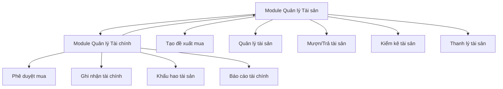

---

# PHẦN I: MODULE QUẢN LÝ TÀI SẢN

## 1. LUỒNG ĐỀ XUẤT MUA TÀI SẢN

### 📊 Sơ đồ luồng:

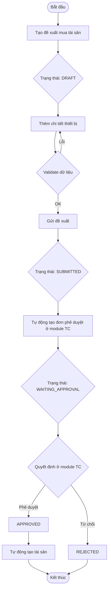

### 🔧 Chi tiết nghiệp vụ:

#### Model: `de_xuat_mua_tai_san`

**States:**
- `draft` → `submitted` → `waiting_approval` → `approved/rejected/cancelled`

**Key Methods:**
- `action_submit()`: Gửi đề xuất, tạo đơn phê duyệt ở module tài chính
- `_create_approval_request()`: Tạo record phe_duyet_mua_tai_san
- `_on_approval_complete()`: Callback khi phê duyệt hoàn tất

**Business Rules:**
1. Phải có ít nhất 1 chi tiết thiết bị
2. Mỗi thiết bị phải có danh mục tài sản
3. Tổng giá trị > 0
4. Chỉ tạo đơn phê duyệt khi state = submitted

---

## 2. LUỒNG QUẢN LÝ TÀI SẢN

### 📊 Sơ đồ vòng đời tài sản:

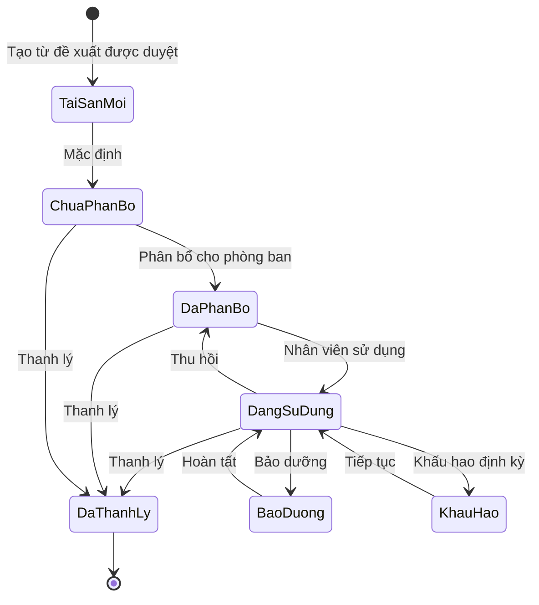

### 🔧 Chi tiết nghiệp vụ:

#### Model: `tai_san`

**Key Fields:**
- `trang_thai_thanh_ly`: Computed từ phân bổ và thanh lý
- `gia_tri_hien_tai`: Được cập nhật qua khấu hao
- `pp_khau_hao`: Phương pháp khấu hao (straight-line/degressive/none)

**Key Methods:**
- `action_tinh_khau_hao()`: Tính khấu hao theo phương pháp
- `_compute_trang_thai_thanh_ly()`: Tính trạng thái từ quan hệ

**Business Rules:**
1. Mã tài sản unique
2. Giá trị hiện tại >= 0
3. Khấu hao chỉ áp dụng khi có phương pháp ≠ 'none'
4. Tài sản đã thanh lý không thể chỉnh sửa

---

## 3. LUỒNG PHÂN BỔ TÀI SẢN

### 📊 Sơ đồ luồng:

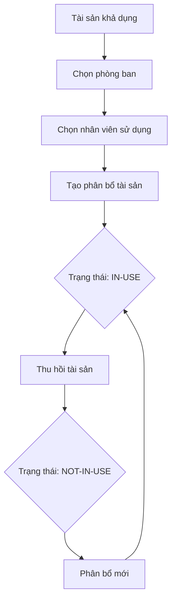

#### Model: `phan_bo_tai_san`

**States:**
- `in-use`: Đang sử dụng
- `not-in-use`: Không sử dụng

**Business Rules:**
1. Một tài sản có thể có nhiều phân bổ theo thời gian
2. Chỉ có một phân bổ active tại một thời điểm
3. Phân bổ ảnh hưởng đến trạng thái tài sản chính

---

## 4. LUỒNG MƯỢN/TRẢ TÀI SẢN

### 📊 Sơ đồ luồng:

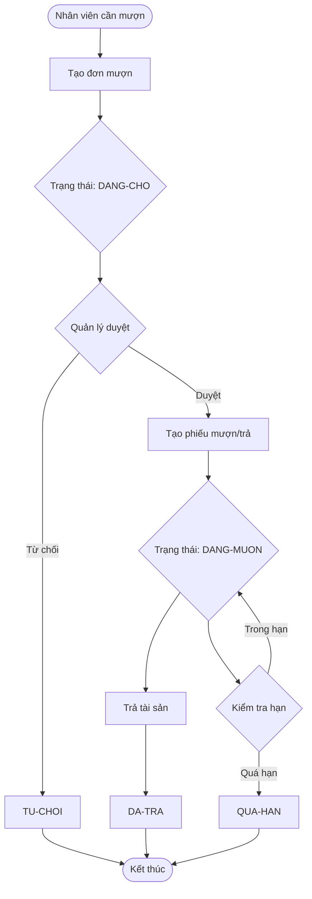

### 🔧 Chi tiết nghiệp vụ:

#### Model: `don_muon_tai_san`
- Đơn yêu cầu mượn từ nhân viên
- States: `dang-cho`, `da-duyet`, `tu-choi`

#### Model: `muon_tra_tai_san`
- Phiếu mượn/trả được tạo từ đơn mượn đã duyệt
- States: `dang-muon`, `da-tra`
- Compute `tinh_trang`: Dựa trên thời gian hiện tại vs thời hạn

**Business Rules:**
1. Thời gian mượn < thời gian trả
2. Không thể trả quá khứ
3. Một đơn mượn → một phiếu mượn/trả
4. Tài sản phải đang available để mượn

---

## 5. LUỒNG KIỂM KÊ TÀI SẢN

### 📊 Sơ đồ luồng:

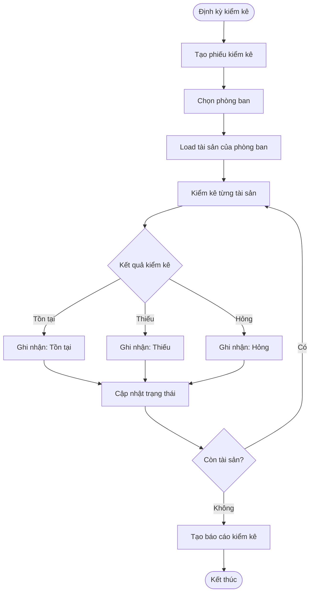

#### Model: `kiem_ke_tai_san` & `kiem_ke_tai_san_line`

**States kiểm kê:**
- `in-progress`: Đang kiểm kê
- `finished`: Đã kiểm kê

**Kết quả kiểm kê:**
- `ton-tai`: Tài sản tồn tại, tình trạng bình thường
- `thieu`: Không tìm thấy tài sản
- `hong`: Tài sản hỏng hóc

---

## 6. LUỒNG LUÂN CHUYỂN TÀI SẢN

### 📊 Sơ đồ luồng:

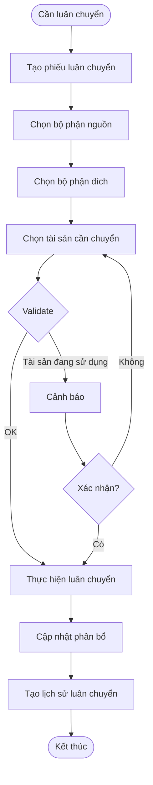

---

## 7. LUỒNG THANH LÝ TÀI SẢN

### 📊 Sơ đồ luồng:

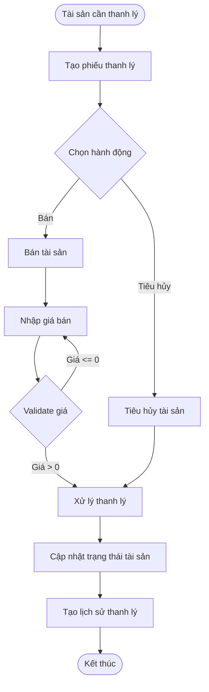

**Business Rules:**
1. Một tài sản chỉ thanh lý một lần
2. Giá bán > 0 nếu chọn hành động "bán"
3. Tài sản thanh lý không thể chỉnh sửa
4. Thu hồi phân bổ trước khi thanh lý

---

# PHẦN II: MODULE QUẢN LÝ TÀI CHÍNH

## 1. LUỒNG PHÊ DUYỆT MUA TÀI SẢN

### 📊 Sơ đồ luồng:

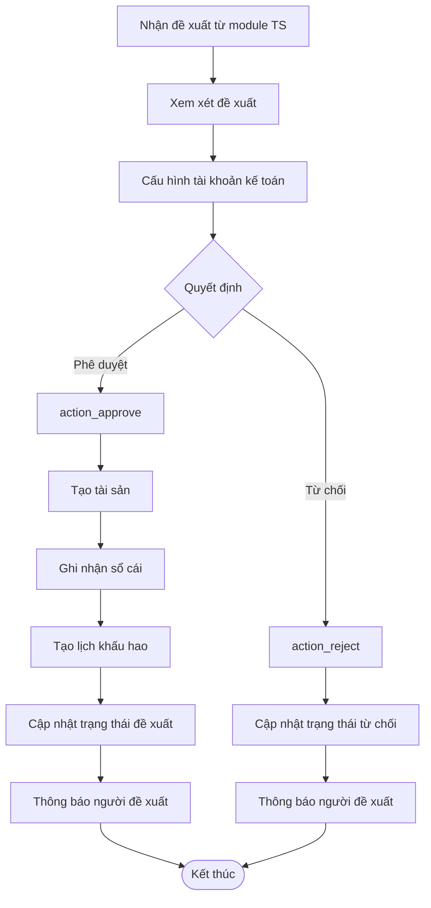

### 🔧 Chi tiết nghiệp vụ:

#### Model: `phe_duyet_mua_tai_san`

**Key Methods:**
- `action_approve()`: Phê duyệt → Tạo tài sản + ghi nhận TC + khấu hao
- `action_reject()`: Từ chối → Cập nhật trạng thái đề xuất
- `_create_assets()`: Tạo tài sản trong module TS
- `_create_journal_entry()`: Ghi bút toán kế toán
- `_create_depreciation_schedule()`: Tạo lịch khấu hao

**Business Logic:**
1. **Tạo tài sản**: Mỗi line tạo nhiều tài sản theo số lượng
2. **Ghi sổ cái**: 
   - Nợ: Tài khoản Tài sản cố định
   - Có: Tài khoản Tiền mặt/Ngân hàng
3. **Khấu hao**: Tự động theo phương pháp và thời gian

---

## 2. LUỒNG KHẤU HAO TÀI SẢN

### 📊 Sơ đồ luồng:

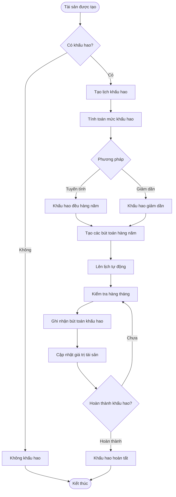

### 🔧 Chi tiết nghiệp vụ:

#### Model: `khau_hao_tai_san` & `lich_khau_hao`

**Phương pháp khấu hao:**
1. **Tuyến tính** (`straight-line`): Giá trị / Số năm
2. **Giảm dần** (`degressive`): Giá trị còn lại × Tỷ lệ%
3. **Không khấu hao** (`none`): Không tạo lịch

**Bút toán khấu hao:**
- Nợ: Chi phí khấu hao (642)
- Có: Khấu hao luỹ kế tài sản cố định (214)

---

## 3. LUỒNG GHI NHẬN SỔ CÁI

### 📊 Sơ đồ luồng:

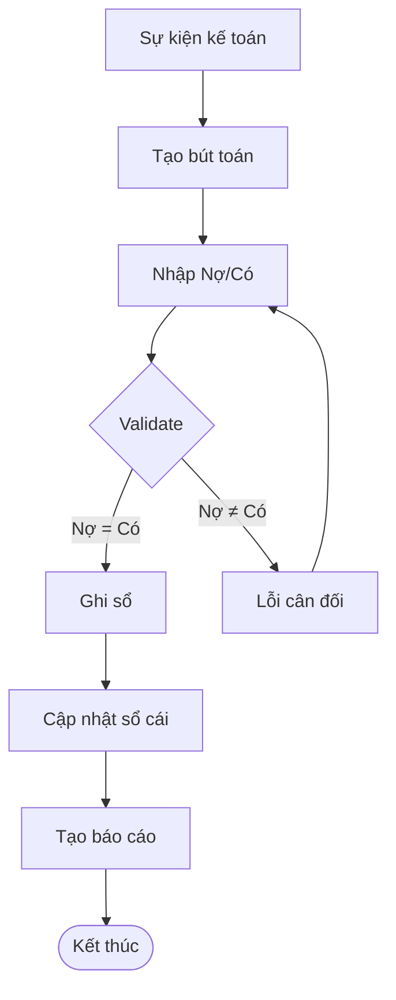

#### Model: `but_toan`

**States:**
- `draft`: Nháp
- `posted`: Đã ghi sổ

**Business Rules:**
1. Tổng nợ = Tổng có
2. Chỉ bút toán posted mới ảnh hưởng báo cáo
3. Tự động tạo số chứng từ

---

## 4. LUỒNG BÁO CÁO TÀI CHÍNH

### 📊 Sơ đồ luồng:

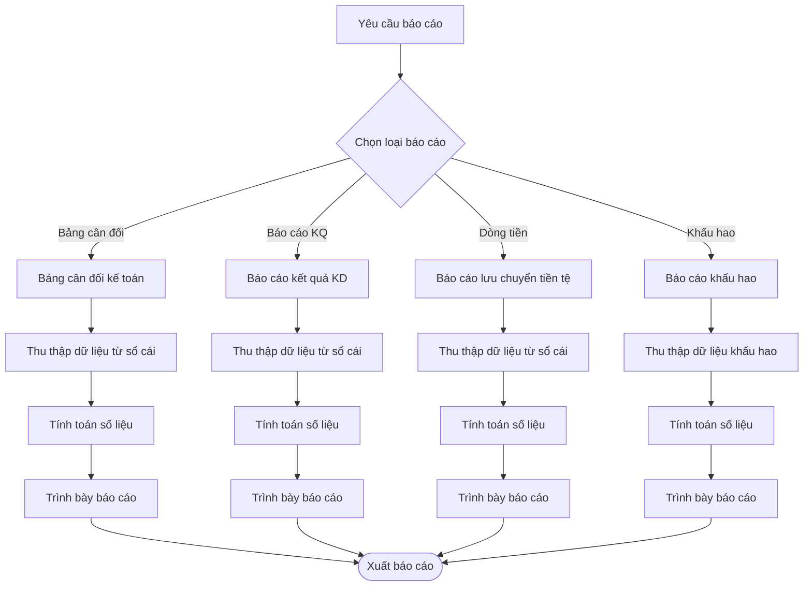

#### Model: `bao_cao_tai_chinh`

**Loại báo cáo:**
- Bảng cân đối kế toán
- Báo cáo kết quả kinh doanh  
- Báo cáo lưu chuyển tiền tệ
- Báo cáo khấu hao tài sản

---

## 5. DASHBOARD TÀI CHÍNH

### 📊 Sơ đồ KPI:

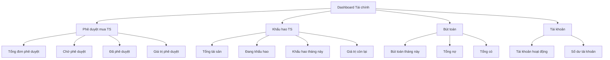

#### Model: `dashboard.tai.chinh`

**Real-time Metrics:**
- Cập nhật theo `ngay_hien_tai`
- Compute từ các model liên quan
- Action methods để drill-down chi tiết

---

# PHẦN III: TÍCH HỢP 2 MODULE

## 1. LUỒNG TÍCH HỢP CHÍNH

### 📊 Sơ đồ tổng thể:

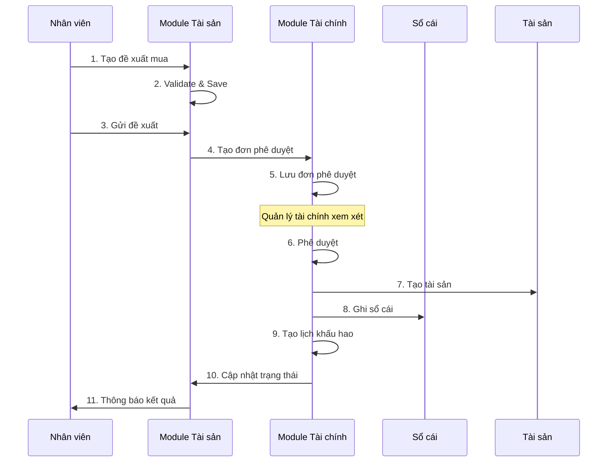

---

## 2. NGHIỆP VỤ PHÁT SINH KHI TÍCH HỢP

### 🔄 Đồng bộ dữ liệu

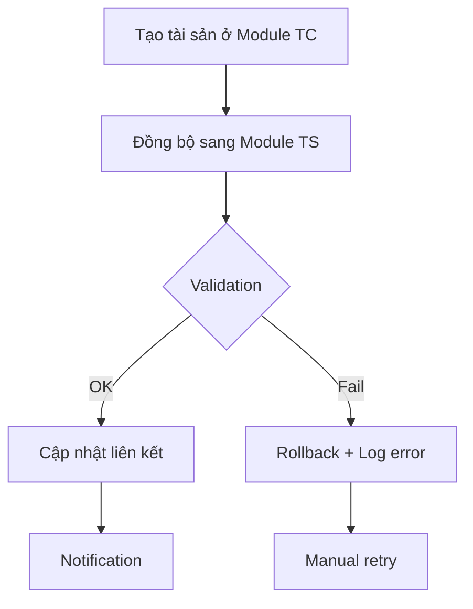

**Key Integration Points:**

1. **Đề xuất → Phê duyệt**
   - Module TS: `de_xuat_mua_tai_san._create_approval_request()`
   - Module TC: `phe_duyet_mua_tai_san.create()`

2. **Phê duyệt → Tài sản**
   - Module TC: `phe_duyet_mua_tai_san.action_approve()`
   - Module TS: `tai_san.create()` (multiple)

3. **Tài sản → Khấu hao**
   - Module TC: `khau_hao_tai_san.create()`
   - Auto schedule: `lich_khau_hao.create()` (multiple)

### 🛠️ Error Handling

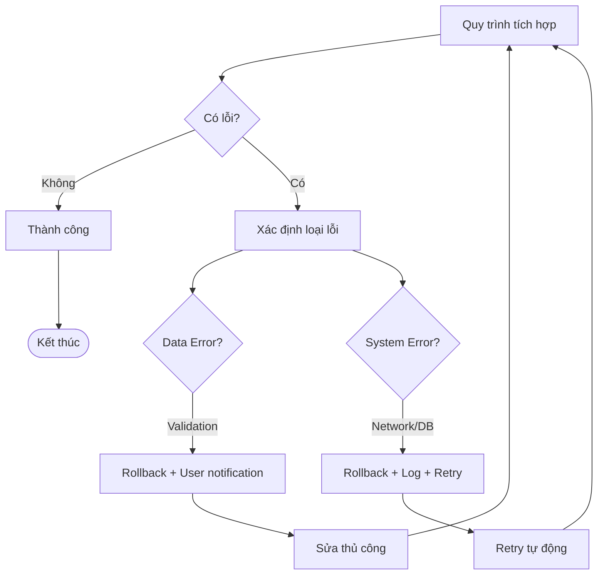

### 📊 Workflow Monitoring

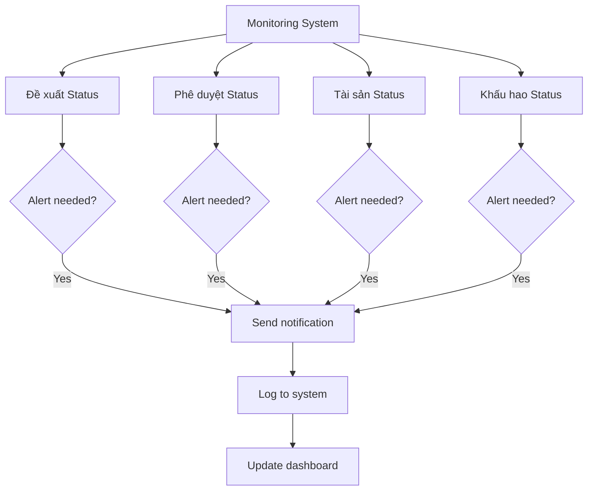

---

# PHẦN IV: NGHIỆP VỤ BỔ SUNG TÍCH HỢP

## 1. TỰ ĐỘNG HÓA QUY TRÌNH

### 📊 Scheduled Jobs:

```mermaid
gantt
    title Lịch trình tự động hóa
    dateFormat  HH:mm
    axisFormat %H:%M
    
    section Hàng ngày
    Kiểm tra đề xuất quá hạn    :done, check1, 00:00, 00:30
    Cập nhật trạng thái mượn    :done, check2, 01:00, 01:30
    Tính khấu hao hàng ngày     :done, dep1,   02:00, 02:30
    
    section Hàng tháng  
    Ghi nhận khấu hao tháng     :crit, dep2,   00:00, 02:00
    Tạo báo cáo tài chính       :crit, report, 08:00, 10:00
    
    section Hàng quý
    Đối soát tài sản            :active, audit, 09:00, 17:00
    Kiểm kê định kỳ            :audit2, 08:00, 17:00
```

### 🔄 Auto-workflows:

1. **Nhắc nhở phê duyệt**: Tự động tạo activity sau 3 ngày
2. **Cảnh báo mượn quá hạn**: Email tự động cho người mượn
3. **Khấu hao hàng tháng**: Batch job tạo bút toán
4. **Kiểm kê định kỳ**: Tự động tạo phiếu kiểm kê theo chu kỳ

---

## 2. BÁO CÁO TÍCH HỢP

### 📊 Cross-module Reports:

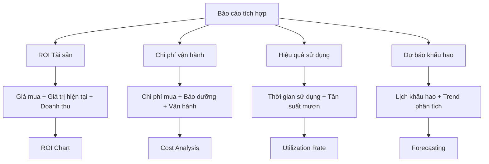

---

## 3. BUSINESS INTELLIGENCE

### 📈 KPI Dashboard Tích hợp:

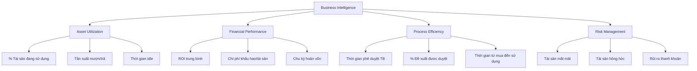

---

# PHẦN V: SECURITY & COMPLIANCE

## 1. PHÂN QUYỀN NGHIỆP VỤ

```mermaid
graph TD
    Roles[User Roles] --> Admin[System Admin]
    Roles --> AssetManager[Asset Manager] 
    Roles --> FinanceManager[Finance Manager]
    Roles --> Employee[Employee]
    
    Admin --> A1[Full access both modules]
    
    AssetManager --> A2[Create/Edit Assets]
    AssetManager --> A3[Asset Allocation]
    AssetManager --> A4[Create Proposals]
    AssetManager --> A5[Asset Reports]
    
    FinanceManager --> F1[Approve Proposals]
    FinanceManager --> F2[Financial Records]
    FinanceManager --> F3[Depreciation Setup]
    FinanceManager --> F4[Financial Reports]
    
    Employee --> E1[Create Borrow Requests]
    Employee --> E2[View Own Requests]
    Employee --> E3[Basic Asset Info]
```

## 2. AUDIT TRAIL

```mermaid
sequenceDiagram
    participant User
    participant System
    participant AuditLog
    participant Database
    
    User->>System: Thực hiện action
    System->>AuditLog: Log action details
    AuditLog->>Database: Store log
    System->>Database: Update data
    System->>User: Return result
    
    Note over AuditLog: User, Time, Action, Before/After values
```

**Tracking Points:**
- Tất cả thay đổi trạng thái đề xuất/phê duyệt
- Phân bổ/thu hồi tài sản
- Ghi nhận tài chính
- Thay đổi giá trị tài sản

---

# PHẦN VI: PERFORMANCE & SCALABILITY

## 1. OPTIMIZATION STRATEGIES

### 📊 Database Optimization:

```mermaid
graph TD
    DB[Database Optimization] --> Index1[Index on frequently queried fields]
    DB --> Archive[Archive old records]
    DB --> Partition[Partition large tables]
    
    Index1 --> I1[tai_san.ma_tai_san]
    Index1 --> I2[phe_duyet_mua_tai_san.state]
    Index1 --> I3[khau_hao_tai_san.ngay_bat_dau]
    
    Archive --> A1[Archived proposals > 2 years]
    Archive --> A2[Completed depreciation schedules]
    
    Partition --> P1[Partition by year]
    Partition --> P2[Partition by department]
```

### 🔄 Caching Strategy:

```mermaid
graph TD
    Cache[Caching Layer] --> Redis1[Dashboard metrics]
    Cache --> Redis2[User permissions]
    Cache --> Redis3[Department assets]
    
    Redis1 --> Refresh1[Refresh every hour]
    Redis2 --> Refresh2[Refresh on role change]
    Redis3 --> Refresh3[Refresh on asset change]
```

---

# KẾT LUẬN

## ✅ ĐIỂM MẠNH HỆ THỐNG

1. **Tách biệt trách nhiệm rõ ràng**: Tài sản vs Tài chính
2. **Workflow tự động hóa**: Giảm thiểu can thiệp thủ công
3. **Tính toàn vẹn dữ liệu**: Validation và rollback cơ chế
4. **Truy vết đầy đủ**: Audit trail cho mọi thay đổi
5. **Báo cáo đa chiều**: Kết hợp cả 2 module

## 🎯 KHUYẾN NGHỊ PHÁT TRIỂN

1. **Mobile App**: Cho việc kiểm kê và mượn/trả
2. **AI/ML**: Dự báo nhu cầu mua sắm và khấu hao
3. **IoT Integration**: Tracking vị trí tài sản real-time
4. **API Gateway**: Tích hợp với hệ thống ERP khác
5. **Blockchain**: Đảm bảo tính bất biến của lịch sử tài sản

---

*Tài liệu này cung cấp cái nhìn tổng quan về luồng nghiệp vụ của hệ thống quản lý tài sản và tài chính. Mỗi luồng có thể được mở rộng với chi tiết kỹ thuật và business rules cụ thể hơn.*