# TẬP HỢP CÁC SƠ ĐỒ CHO CHƯƠNG 3
## Phân tích, Thiết kế và Triển khai Hệ thống

**Hướng dẫn sử dụng:**
- Các sơ đồ được vẽ bằng Mermaid
- Để xuất hình ảnh: 
  1. Truy cập https://mermaid.live
  2. Copy code Mermaid vào
  3. Xuất PNG/SVG
- Hoặc sử dụng VS Code extension "Markdown Preview Mermaid Support"

---

# HÌNH 3.1: SƠ ĐỒ KIẾN TRÚC TỔNG THỂ HỆ THỐNG

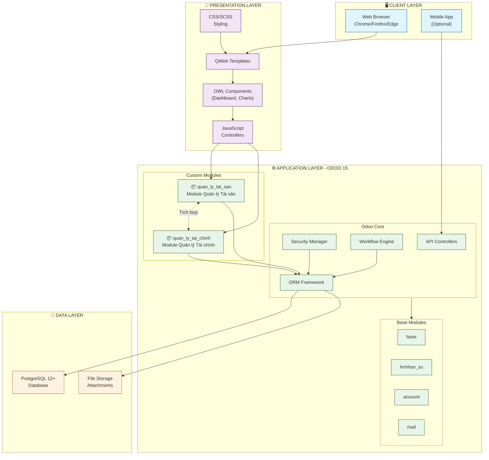

---

# HÌNH 3.2: SƠ ĐỒ USE CASE TỔNG QUÁT

```mermaid
flowchart TB
    subgraph SYSTEM["HỆ THỐNG QUẢN LÝ TÀI SẢN VÀ TÀI CHÍNH"]
        
        subgraph UC_ASSET["Module Quản lý Tài sản"]
            UC1["🔸 Quản lý danh mục<br/>tài sản"]
            UC2["🔸 Quản lý tài sản<br/>cụ thể"]
            UC3["🔸 Phân bổ tài sản<br/>cho phòng ban"]
            UC4["🔸 Tạo đề xuất<br/>mua tài sản"]
            UC5["🔸 Quản lý mượn/trả<br/>tài sản"]
            UC6["🔸 Kiểm kê tài sản"]
            UC7["🔸 Luân chuyển<br/>tài sản"]
            UC8["🔸 Thanh lý tài sản"]
            UC9["🔸 Xem Dashboard<br/>tổng quan"]
        end
        
        subgraph UC_FINANCE["Module Quản lý Tài chính"]
            UC10["🔹 Phê duyệt đề xuất<br/>mua tài sản"]
            UC11["🔹 Tạo tài sản<br/>tự động"]
            UC12["🔹 Quản lý khấu hao<br/>tài sản"]
            UC13["🔹 Ghi bút toán<br/>kế toán"]
            UC14["🔹 Quản lý tài khoản<br/>quản trị"]
            UC15["🔹 Tạo báo cáo<br/>tài chính"]
            UC16["🔹 Xem Dashboard<br/>tài chính"]
        end
    end
    
    NV["👤 Nhân viên"]
    QLTS["👤 Quản lý<br/>Tài sản"]
    QLTC["👤 Quản lý<br/>Tài chính"]
    ADMIN["👤 Admin"]
    
    NV --> UC4
    NV --> UC5
    NV --> UC9
    
    QLTS --> UC1
    QLTS --> UC2
    QLTS --> UC3
    QLTS --> UC5
    QLTS --> UC6
    QLTS --> UC7
    QLTS --> UC8
    QLTS --> UC9
    
    QLTC --> UC10
    QLTC --> UC11
    QLTC --> UC12
    QLTC --> UC13
    QLTC --> UC14
    QLTC --> UC15
    QLTC --> UC16
    
    ADMIN --> UC1
    ADMIN --> UC2
    ADMIN --> UC3
    ADMIN --> UC10
    ADMIN --> UC16
    
    UC4 -.->|"<<extend>>"| UC10
    UC10 -.->|"<<include>>"| UC11
    UC10 -.->|"<<include>>"| UC12
    UC10 -.->|"<<include>>"| UC13

    classDef actorStyle fill:#bbdefb,stroke:#1565c0
    classDef assetStyle fill:#c8e6c9,stroke:#2e7d32
    classDef financeStyle fill:#ffe0b2,stroke:#ef6c00
    
    class NV,QLTS,QLTC,ADMIN actorStyle
    class UC1,UC2,UC3,UC4,UC5,UC6,UC7,UC8,UC9 assetStyle
    class UC10,UC11,UC12,UC13,UC14,UC15,UC16 financeStyle
```

---

# HÌNH 3.3: SƠ ĐỒ ERD TỔNG QUAN

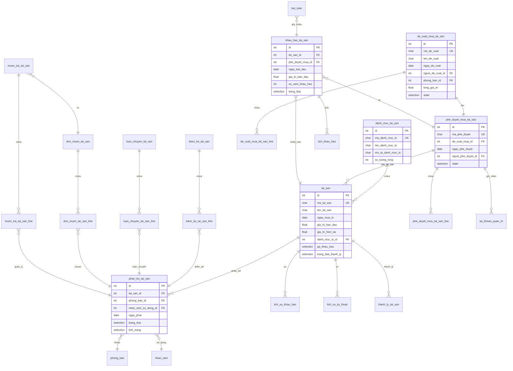

---

# HÌNH 3.4: SƠ ĐỒ ERD CHI TIẾT - MODULE QUẢN LÝ TÀI SẢN

```mermaid
erDiagram
    danh_muc_tai_san {
        int id PK "Khóa chính"
        char ma_danh_muc_ts UK "Mã loại tài sản - VD: DMTS001"
        char ten_danh_muc_ts "Tên loại tài sản"
        char mo_ta_danh_muc_ts "Mô tả chi tiết"
        int so_luong_tong "Computed - Số lượng tài sản"
    }

    tai_san {
        int id PK "Khóa chính"
        char ma_tai_san UK "Mã tài sản - VD: TS-00001"
        char ten_tai_san "Tên tài sản"
        date ngay_mua_ts "Ngày mua tài sản"
        selection don_vi_tien_te "vnd hoặc usd"
        float gia_tri_ban_dau "Giá trị ban đầu"
        float gia_tri_hien_tai "Giá trị còn lại"
        int danh_muc_ts_id FK "FK - Danh mục tài sản"
        binary giay_to_tai_san "File đính kèm"
        image hinh_anh "Hình ảnh tài sản"
        selection pp_khau_hao "straight-line/degressive/none"
        int thoi_gian_su_dung "Số năm đã sử dụng"
        int thoi_gian_toi_da "Số năm tối đa"
        float ty_le_khau_hao "Tỷ lệ khấu hao %"
        char don_vi_tinh "Đơn vị tính"
        char ghi_chu "Ghi chú"
        selection trang_thai_thanh_ly "Computed - Trạng thái"
    }

    phan_bo_tai_san {
        int id PK "Khóa chính"
        int tai_san_id FK "FK - Tài sản"
        int phong_ban_id FK "FK - Phòng ban"
        int nhan_vien_su_dung_id FK "FK - Nhân viên sử dụng"
        date ngay_phat "Ngày phân bổ"
        selection trang_thai "in-use/not-in-use"
        selection tinh_trang "binh_thuong/dang_muon/hu_hong/mat"
        int vi_tri_tai_san_id FK "FK - Vị trí thực tế"
        char ghi_chu "Ghi chú"
    }

    de_xuat_mua_tai_san {
        int id PK "Khóa chính"
        char ma_de_xuat UK "Mã đề xuất - Auto"
        char ten_de_xuat "Tiêu đề đề xuất"
        date ngay_de_xuat "Ngày tạo đề xuất"
        int nguoi_de_xuat_id FK "FK - Người đề xuất"
        int phong_ban_id FK "FK - Phòng ban"
        float tong_gia_tri "Computed - Tổng tiền"
        selection don_vi_tien_te "vnd/usd"
        text ly_do "Lý do đề xuất"
        html mo_ta "Mô tả chi tiết"
        selection state "draft/submitted/waiting_approval/approved/rejected/cancelled"
        date ngay_du_kien_nhan "Ngày dự kiến nhận"
        int phe_duyet_id FK "FK - Đơn phê duyệt"
    }

    de_xuat_mua_tai_san_line {
        int id PK "Khóa chính"
        int de_xuat_id FK "FK - Đề xuất cha"
        char ten_thiet_bi "Tên thiết bị"
        int danh_muc_ts_id FK "FK - Danh mục"
        text mo_ta "Mô tả"
        text thong_so_ky_thuat "Thông số kỹ thuật"
        int so_luong "Số lượng"
        char don_vi_tinh "Đơn vị tính"
        float don_gia "Đơn giá"
        float thanh_tien "Computed - Thành tiền"
        selection pp_khau_hao "Phương pháp khấu hao"
        int thoi_gian_su_dung "Thời gian sử dụng (năm)"
        float ty_le_khau_hao "Tỷ lệ khấu hao"
        char nha_cung_cap "Nhà cung cấp"
    }

    don_muon_tai_san {
        int id PK "Khóa chính"
        char ma_don_muon UK "Mã đơn mượn - Auto"
        char ten_don_muon "Tên đơn mượn"
        int phong_ban_cho_muon_id FK "FK - Phòng ban cho mượn"
        datetime thoi_gian_muon "Thời gian bắt đầu mượn"
        datetime thoi_gian_tra "Thời gian trả dự kiến"
        int nhan_vien_muon_id FK "FK - Nhân viên mượn"
        text ly_do "Lý do mượn"
        selection trang_thai "nhap/cho_duyet/da_duyet/dang_muon/da_tra/tu_choi/huy"
        int nguoi_duyet_id FK "FK - Người duyệt"
        text ghi_chu "Ghi chú"
    }

    don_muon_tai_san_line {
        int id PK "Khóa chính"
        int don_muon_id FK "FK - Đơn mượn cha"
        int phan_bo_tai_san_id FK "FK - Tài sản mượn"
        int so_luong "Số lượng mượn"
        selection tinh_trang_truoc_muon "tot/binh_thuong/cu/hu_hong_nhe"
        selection tinh_trang_sau_tra "tot/binh_thuong/hu_hong/mat"
        datetime thoi_gian_cho_muon "Thời gian cho mượn thực tế"
        datetime thoi_gian_tra_thuc_te "Thời gian trả thực tế"
        selection trang_thai_line "cho_muon/dang_muon/da_tra"
        char ghi_chu "Ghi chú"
    }

    muon_tra_tai_san {
        int id PK "Khóa chính"
        char ma_phieu_muon_tra UK "Mã phiếu - Auto"
        char ten_phieu_muon_tra "Tên phiếu"
        int ma_don_muon_id FK "FK - Đơn mượn gốc"
        int phong_ban_cho_muon_id FK "FK - Phòng ban cho mượn"
        int nhan_vien_muon_id FK "FK - Nhân viên mượn"
        datetime thoi_gian_muon "Thời gian mượn dự kiến"
        datetime thoi_gian_muon_thuc_te "Thời gian mượn thực tế"
        datetime thoi_gian_tra_du_kien "Thời gian trả dự kiến"
        datetime thoi_gian_tra_thuc_te "Thời gian trả thực tế"
        text ly_do_muon "Lý do mượn"
        selection trang_thai "cho_duyet/da_duyet/dang_muon/da_tra/tu_choi"
    }

    muon_tra_tai_san_line {
        int id PK "Khóa chính"
        int muon_tra_id FK "FK - Phiếu mượn trả cha"
        int phan_bo_tai_san_id FK "FK - Tài sản"
        int so_luong "Số lượng"
        char ghi_chu "Ghi chú"
    }

    kiem_ke_tai_san {
        int id PK "Khóa chính"
        char ma_phieu_kiem_ke UK "Mã phiếu - KKTS-xxx"
        char ten_phieu_kiem_ke "Tên phiếu"
        int phong_ban_id FK "FK - Phòng ban kiểm kê"
        int nhan_vien_kiem_ke_id FK "FK - Người kiểm kê"
        datetime thoi_gian_tao "Thời gian tạo phiếu"
        char trang_thai_phieu "Computed - Đã/Chưa kiểm kê"
        char ghi_chu "Ghi chú"
    }

    kiem_ke_tai_san_line {
        int id PK "Khóa chính"
        int kiem_ke_tai_san_id FK "FK - Phiếu kiểm kê cha"
        int phan_bo_tai_san_id FK "FK - Tài sản kiểm kê"
        int so_luong_thuc_te "Số lượng thực tế"
        int so_luong_ly_thuyet "Số lượng sổ sách - Default 1"
        char dvt "Related - Đơn vị tính"
        selection trang_thai "not-finished/finished"
        selection trang_thai_tai_san "good/broken/lost"
        char ghi_chu "Ghi chú tình trạng"
    }

    luan_chuyen_tai_san {
        int id PK "Khóa chính"
        char ma_phieu_luan_chuyen UK "Mã phiếu - LCTS-xxx"
        int bo_phan_nguon FK "FK - Bộ phận hiện tại"
        int bo_phan_dich FK "FK - Bộ phận chuyển đến"
        datetime thoi_gian_luan_chuyen "Thời gian luân chuyển"
        char ghi_chu "Lý do luân chuyển"
    }

    luan_chuyen_tai_san_line {
        int id PK "Khóa chính"
        int luan_chuyen_id FK "FK - Phiếu luân chuyển cha"
        int phan_bo_tai_san_id FK "FK - Tài sản luân chuyển"
        int so_luong "Số lượng - Default 1"
        char ghi_chu "Ghi chú"
    }

    thanh_ly_tai_san {
        int id PK "Khóa chính"
        char ma_thanh_ly UK "Mã thanh lý - TL-xxx"
        selection hanh_dong "ban/huy"
        int tai_san_id FK "FK - Tài sản thanh lý"
        int nguoi_thanh_ly_id FK "FK - Người thực hiện"
        datetime thoi_gian_thanh_ly "Thời gian thanh lý"
        char ly_do_thanh_ly "Lý do"
        float gia_ban "Giá bán"
        float gia_goc "Computed - Giá gốc"
    }

    lich_su_khau_hao {
        int id PK "Khóa chính"
        char ma_phieu_khau_hao UK "Mã phiếu - KHTS-xxx"
        int ma_ts FK "FK - Tài sản"
        datetime ngay_khau_hao "Ngày khấu hao"
        float gia_tri_hien_tai "Related - Giá trị hiện tại"
        float so_tien_khau_hao "Số tiền khấu hao"
        float gia_tri_con_lai "Giá trị còn lại"
        selection loai_phieu "automatic/manual"
        char ghi_chu "Ghi chú"
    }

    lich_su_ky_thuat {
        int id PK "Khóa chính"
        int tai_san_id FK "FK - Tài sản"
        char noi_dung "Nội dung ghi nhận"
        date ngay "Ngày ghi nhận"
        char ghi_chu "Ghi chú"
    }

    %% RELATIONSHIPS
    danh_muc_tai_san ||--o{ tai_san : "1-N"
    tai_san ||--o{ phan_bo_tai_san : "1-N"
    tai_san ||--o{ lich_su_khau_hao : "1-N"
    tai_san ||--o{ lich_su_ky_thuat : "1-N"
    tai_san ||--o{ thanh_ly_tai_san : "1-1"
    
    de_xuat_mua_tai_san ||--o{ de_xuat_mua_tai_san_line : "1-N"
    
    don_muon_tai_san ||--o{ don_muon_tai_san_line : "1-N"
    don_muon_tai_san_line }o--|| phan_bo_tai_san : "N-1"
    
    muon_tra_tai_san ||--o{ muon_tra_tai_san_line : "1-N"
    muon_tra_tai_san }o--|| don_muon_tai_san : "N-1"
    muon_tra_tai_san_line }o--|| phan_bo_tai_san : "N-1"
    
    kiem_ke_tai_san ||--o{ kiem_ke_tai_san_line : "1-N"
    kiem_ke_tai_san_line }o--|| phan_bo_tai_san : "N-1"
    
    luan_chuyen_tai_san ||--o{ luan_chuyen_tai_san_line : "1-N"
    luan_chuyen_tai_san_line }o--|| phan_bo_tai_san : "N-1"
```

---

# HÌNH 3.5 (Part 2): SƠ ĐỒ ERD CHI TIẾT - MODULE QUẢN LÝ TÀI CHÍNH

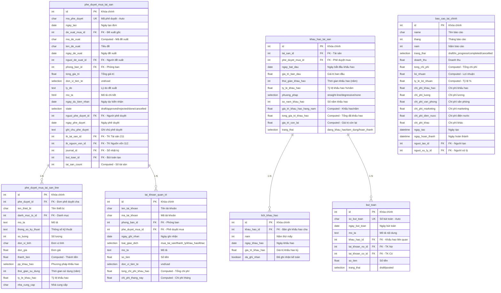

---

# HÌNH 3.5: SƠ ĐỒ LUỒNG TỔNG QUAN HỆ THỐNG

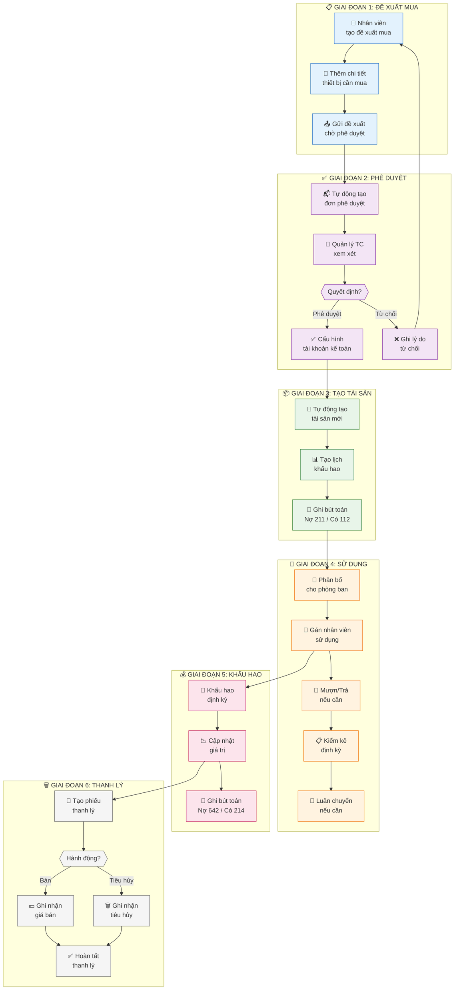

---

# HÌNH 3.6: SƠ ĐỒ LUỒNG ĐỀ XUẤT MUA TÀI SẢN

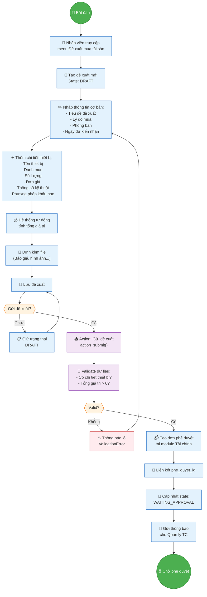

---

# HÌNH 3.7: SƠ ĐỒ VÒNG ĐỜI TÀI SẢN

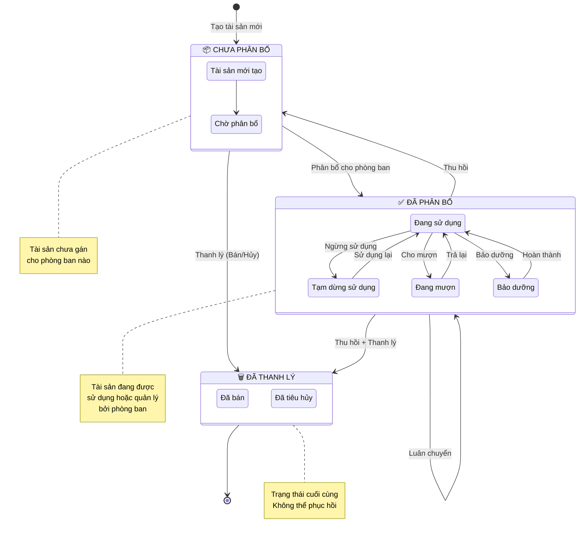

---

# HÌNH 3.8: SƠ ĐỒ LUỒNG MƯỢN TRẢ TÀI SẢN

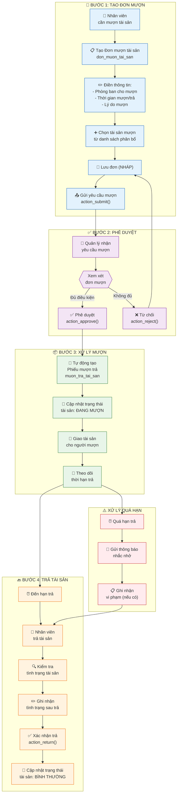

---

# HÌNH 3.9: SƠ ĐỒ LUỒNG KIỂM KÊ TÀI SẢN

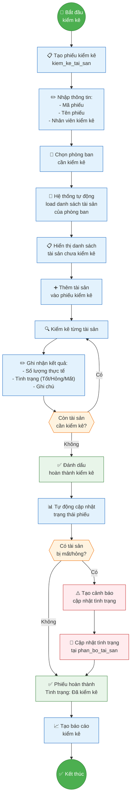

---

# HÌNH 3.10: SƠ ĐỒ LUỒNG KHẤU HAO TÀI SẢN

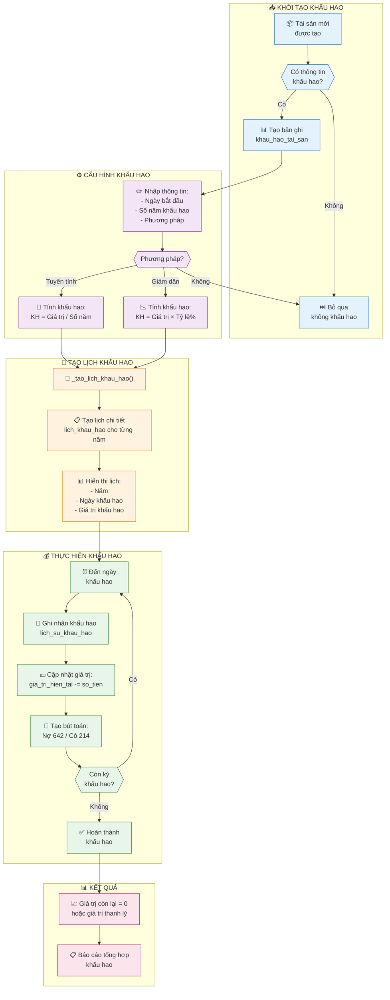

---

# HÌNH 3.11: SƠ ĐỒ LUỒNG THANH LÝ TÀI SẢN

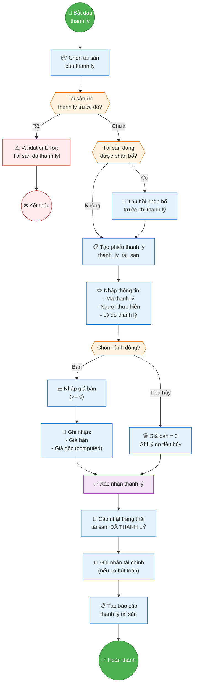

---

# HÌNH 3.12: GIAO DIỆN DASHBOARD TỔNG QUAN TÀI SẢN

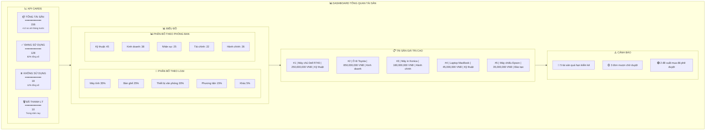

---

# HÌNH 3.13: GIAO DIỆN FORM TÀI SẢN

```mermaid
flowchart TB
    subgraph FORM["📋 FORM TÀI SẢN - tai_san"]
        subgraph HEADER["🔝 HEADER"]
            direction LR
            H1["<b>Mã:</b> TS-00045"]
            H2["<b>Tên:</b> Laptop Dell XPS 15"]
            H3["🏷️ Trạng thái: ĐÃ PHÂN BỔ"]
        end
        
        subgraph BUTTONS["🔘 BUTTONS"]
            direction LR
            BTN1["📊 Khấu hao"]
            BTN2["📍 Phân bổ"]
            BTN3["📜 Lịch sử"]
            BTN4["🗑️ Thanh lý"]
        end
        
        subgraph TAB1["📑 TAB: THÔNG TIN CHUNG"]
            direction TB
            subgraph LEFT["Cột trái"]
                L1["<b>Mã tài sản:</b> TS-00045"]
                L2["<b>Tên tài sản:</b> Laptop Dell XPS 15"]
                L3["<b>Loại tài sản:</b> Máy tính"]
                L4["<b>Ngày mua:</b> 15/03/2025"]
                L5["<b>Đơn vị tính:</b> Chiếc"]
            end
            subgraph RIGHT["Cột phải"]
                R1["<b>Giá trị ban đầu:</b> 45,000,000 VNĐ"]
                R2["<b>Giá trị hiện tại:</b> 36,000,000 VNĐ"]
                R3["<b>📷 Hình ảnh</b>"]
                R4["<b>📎 File đính kèm:</b> warranty.pdf"]
            end
        end
        
        subgraph TAB2["📑 TAB: KHẤU HAO"]
            KH1["<b>Phương pháp:</b> Tuyến tính"]
            KH2["<b>Thời gian sử dụng:</b> 1 năm"]
            KH3["<b>Thời gian tối đa:</b> 5 năm"]
            KH4["<b>Tỷ lệ khấu hao:</b> 20%/năm"]
        end
        
        subgraph TAB3["📑 TAB: PHÂN BỔ"]
            PB1["| Phòng ban | Nhân viên | Ngày phân bổ | Trạng thái |"]
            PB2["| Kỹ thuật  | Nguyễn A | 20/03/2025  | Đang dùng  |"]
        end
        
        subgraph TAB4["📑 TAB: LỊCH SỬ"]
            LS1["📊 Lịch sử khấu hao"]
            LS2["📋 Lịch sử kiểm kê"]
            LS3["🔀 Lịch sử luân chuyển"]
            LS4["🔧 Lịch sử kỹ thuật"]
        end
    end
    
    HEADER --> BUTTONS
    BUTTONS --> TAB1
    TAB1 --> TAB2
    TAB2 --> TAB3
    TAB3 --> TAB4
```

---

# HÌNH 3.14: GIAO DIỆN FORM ĐỀ XUẤT MUA TÀI SẢN

```mermaid
flowchart TB
    subgraph FORM["📋 FORM ĐỀ XUẤT MUA TÀI SẢN"]
        subgraph HEADER["🔝 HEADER"]
            direction LR
            H1["<b>Mã:</b> DXMTS-00012"]
            H2["📅 Ngày: 25/01/2026"]
            H3["🏷️ Trạng thái: CHỜ PHÊ DUYỆT"]
        end
        
        subgraph BUTTONS["🔘 ACTION BUTTONS"]
            direction LR
            BTN1["📤 GỬI ĐỀ XUẤT"]
            BTN2["❌ HỦY"]
            BTN3["📋 XEM PHÊ DUYỆT"]
        end
        
        subgraph INFO["📝 THÔNG TIN ĐỀ XUẤT"]
            direction TB
            subgraph COL1[""]
                I1["<b>Tiêu đề:</b> Mua laptop cho phòng Kỹ thuật"]
                I2["<b>Người đề xuất:</b> Trần Văn B"]
                I3["<b>Phòng ban:</b> Phòng Kỹ thuật"]
            end
            subgraph COL2[""]
                I4["<b>Ngày dự kiến nhận:</b> 15/02/2026"]
                I5["<b>Đơn vị tiền tệ:</b> VNĐ"]
                I6["<b>💰 TỔNG GIÁ TRỊ:</b> 135,000,000"]
            end
        end
        
        subgraph LINES["📦 CHI TIẾT THIẾT BỊ"]
            LINE_HEADER["| # | Tên thiết bị | Danh mục | SL | Đơn giá | Thành tiền |"]
            LINE1["| 1 | Laptop Dell XPS 15 | Máy tính | 3 | 45,000,000 | 135,000,000 |"]
            LINE2["| ➕ Thêm dòng |"]
        end
        
        subgraph REASON["📝 LÝ DO VÀ MÔ TẢ"]
            R1["<b>Lý do đề xuất:</b>"]
            R2["Phòng Kỹ thuật cần bổ sung thêm laptop cho nhân viên mới..."]
            R3["<b>Mô tả chi tiết:</b> (Rich Text Editor)"]
        end
        
        subgraph ATTACH["📎 FILE ĐÍNH KÈM"]
            A1["📄 bao_gia_dell.pdf"]
            A2["🖼️ laptop_specs.png"]
            A3["➕ Thêm file"]
        end
    end
    
    HEADER --> BUTTONS
    BUTTONS --> INFO
    INFO --> LINES
    LINES --> REASON
    REASON --> ATTACH
```

---

# HÌNH 3.15: GIAO DIỆN DASHBOARD TÀI CHÍNH

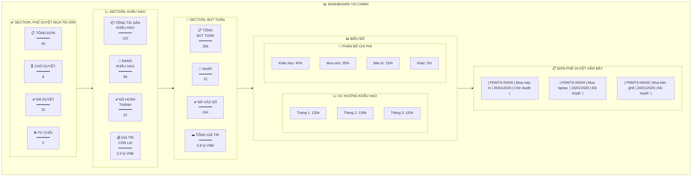

---

# HÌNH 3.16: GIAO DIỆN FORM PHÊ DUYỆT MUA TÀI SẢN

```mermaid
flowchart TB
    subgraph FORM["📋 FORM PHÊ DUYỆT MUA TÀI SẢN"]
        subgraph HEADER["🔝 HEADER"]
            direction LR
            H1["<b>Mã phê duyệt:</b> PDMTS-00045"]
            H2["📅 Ngày: 25/01/2026"]
            H3["🏷️ Trạng thái: CHỜ XỬ LÝ"]
        end
        
        subgraph BUTTONS["🔘 ACTION BUTTONS"]
            direction LR
            BTN1["✅ PHÊ DUYỆT"]
            BTN2["❌ TỪ CHỐI"]
            BTN3["📦 XEM TÀI SẢN (0)"]
        end
        
        subgraph PROPOSAL_INFO["📝 THÔNG TIN ĐỀ XUẤT (Readonly)"]
            direction TB
            subgraph COL1[""]
                P1["<b>Mã đề xuất:</b> DXMTS-00012"]
                P2["<b>Tiêu đề:</b> Mua laptop cho phòng Kỹ thuật"]
                P3["<b>Người đề xuất:</b> Trần Văn B"]
            end
            subgraph COL2[""]
                P4["<b>Phòng ban:</b> Phòng Kỹ thuật"]
                P5["<b>Ngày đề xuất:</b> 24/01/2026"]
                P6["<b>💰 Tổng giá trị:</b> 135,000,000 VNĐ"]
            end
        end
        
        subgraph LINES["📦 CHI TIẾT THIẾT BỊ (Readonly)"]
            LINE_H["| Thiết bị | Danh mục | SL | Đơn giá | PP Khấu hao | Thời gian |"]
            LINE1["| Laptop Dell XPS | Máy tính | 3 | 45,000,000 | Tuyến tính | 5 năm |"]
        end
        
        subgraph ACCOUNT_CONFIG["⚙️ CẤU HÌNH TÀI KHOẢN"]
            AC1["<b>TK Tài sản cố định:</b> 211 - TSCĐ hữu hình"]
            AC2["<b>TK Nguồn vốn:</b> 1121 - Tiền gửi ngân hàng"]
            AC3["<b>Sổ nhật ký:</b> Sổ mua hàng"]
        end
        
        subgraph APPROVAL_INFO["✅ THÔNG TIN PHÊ DUYỆT"]
            AI1["<b>Người phê duyệt:</b> (Tự động điền)"]
            AI2["<b>Ngày phê duyệt:</b> (Tự động điền)"]
            AI3["<b>Ghi chú phê duyệt:</b> (Nhập nếu cần)"]
        end
    end
    
    HEADER --> BUTTONS
    BUTTONS --> PROPOSAL_INFO
    PROPOSAL_INFO --> LINES
    LINES --> ACCOUNT_CONFIG
    ACCOUNT_CONFIG --> APPROVAL_INFO
```

---

# HÌNH 3.17: MẪU BÁO CÁO TÀI CHÍNH

```mermaid
flowchart TB
    subgraph REPORT["📊 BÁO CÁO TÀI CHÍNH THÁNG 01/2026"]
        subgraph HEADER["🏢 HEADER BÁO CÁO"]
            H1["<b>CÔNG TY TNHH ABC</b>"]
            H2["━━━━━━━━━━━━━━━━━━━━"]
            H3["<b>BÁO CÁO TÀI CHÍNH</b>"]
            H4["Kỳ báo cáo: Tháng 01/2026"]
        end
        
        subgraph SUMMARY["📈 TỔNG HỢP"]
            direction LR
            S1["💰 DOANH THU<br/>━━━━━━━━<br/>500,000,000 VNĐ"]
            S2["💸 TỔNG CHI PHÍ<br/>━━━━━━━━<br/>380,000,000 VNĐ"]
            S3["📊 LỢI NHUẬN<br/>━━━━━━━━<br/>120,000,000 VNĐ"]
            S4["📈 TỶ LỆ LN<br/>━━━━━━━━<br/>24%"]
        end
        
        subgraph DETAIL["📋 CHI TIẾT CHI PHÍ"]
            D1["| Loại chi phí | Số tiền | Tỷ lệ |"]
            D2["| Chi phí khấu hao | 45,000,000 | 11.8% |"]
            D3["| Chi phí lương | 200,000,000 | 52.6% |"]
            D4["| Chi phí văn phòng | 35,000,000 | 9.2% |"]
            D5["| Chi phí marketing | 50,000,000 | 13.2% |"]
            D6["| Chi phí điện nước | 20,000,000 | 5.3% |"]
            D7["| Chi phí khác | 30,000,000 | 7.9% |"]
            D8["| <b>TỔNG CỘNG</b> | <b>380,000,000</b> | <b>100%</b> |"]
        end
        
        subgraph CHART["📊 BIỂU ĐỒ PHÂN BỔ CHI PHÍ"]
            C1["🥧 Pie Chart hiển thị % từng loại chi phí"]
        end
        
        subgraph FOOTER["📝 FOOTER"]
            F1["Ngày lập: 28/01/2026"]
            F2["Người lập: Nguyễn Văn A"]
            F3["━━━━━━━━━━━━━━━━━"]
            F4["Chữ ký: _______________"]
        end
    end
    
    HEADER --> SUMMARY
    SUMMARY --> DETAIL
    DETAIL --> CHART
    CHART --> FOOTER
```

---

# HÌNH 3.18: SƠ ĐỒ TÍCH HỢP 2 MODULE

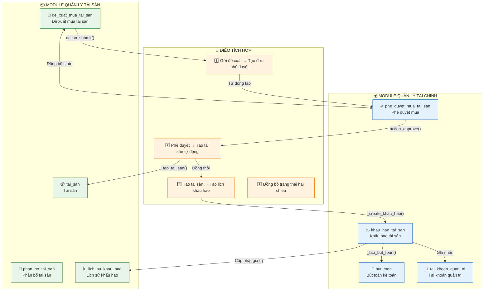

---

# HÌNH 3.19: SEQUENCE DIAGRAM - LUỒNG TÍCH HỢP MUA TÀI SẢN

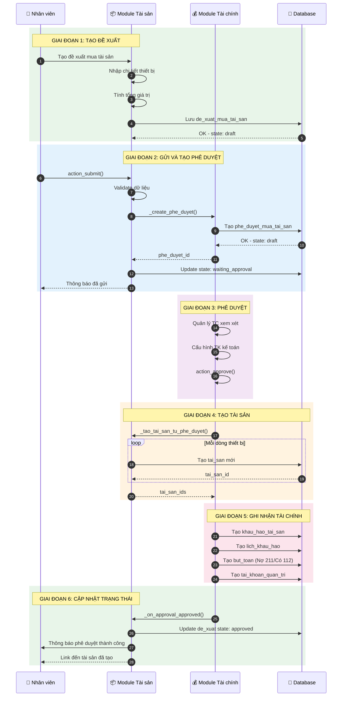

---

# BẢNG TÓM TẮT 19 HÌNH ẢNH

| STT | Mã hình | Tên hình | Loại sơ đồ | Mô tả |
|-----|---------|----------|------------|-------|
| 1 | HÌNH 3.1 | Kiến trúc tổng thể hệ thống | Flowchart | Mô hình 3 lớp Client-Application-Data |
| 2 | HÌNH 3.2 | Use Case tổng quát | Use Case | Tất cả actors và use cases của hệ thống |
| 3 | HÌNH 3.3 | ERD tổng quan | ERD | Quan hệ giữa các bảng chính |
| 4 | HÌNH 3.4 | ERD chi tiết Module Tài sản | ERD | Chi tiết 13 bảng module tài sản |
| 5 | HÌNH 3.5 (Part 2) | ERD chi tiết Module Tài chính | ERD | Chi tiết 7 bảng module tài chính |
| 6 | HÌNH 3.5 | Luồng tổng quan hệ thống | Flowchart | 6 giai đoạn vòng đời tài sản |
| 7 | HÌNH 3.6 | Luồng đề xuất mua tài sản | Flowchart | Chi tiết quy trình tạo đề xuất |
| 8 | HÌNH 3.7 | Vòng đời tài sản | State Diagram | Các trạng thái và chuyển đổi |
| 9 | HÌNH 3.8 | Luồng mượn/trả tài sản | Flowchart | 4 bước quy trình mượn trả |
| 10 | HÌNH 3.9 | Luồng kiểm kê tài sản | Flowchart | Chi tiết quy trình kiểm kê |
| 11 | HÌNH 3.10 | Luồng khấu hao tài sản | Flowchart | Khởi tạo, cấu hình, thực hiện khấu hao |
| 12 | HÌNH 3.11 | Luồng thanh lý tài sản | Flowchart | Quy trình bán/tiêu hủy tài sản |
| 13 | HÌNH 3.12 | Dashboard Tổng quan Tài sản | UI Mockup | Giao diện dashboard module tài sản |
| 14 | HÌNH 3.13 | Form Tài sản | UI Mockup | Giao diện form chi tiết tài sản |
| 15 | HÌNH 3.14 | Form Đề xuất mua tài sản | UI Mockup | Giao diện form đề xuất |
| 16 | HÌNH 3.15 | Dashboard Tài chính | UI Mockup | Giao diện dashboard module tài chính |
| 17 | HÌNH 3.16 | Form Phê duyệt mua tài sản | UI Mockup | Giao diện form phê duyệt |
| 18 | HÌNH 3.17 | Mẫu báo cáo tài chính | Report Template | Layout báo cáo tài chính |
| 19 | HÌNH 3.18 | Sơ đồ tích hợp 2 module | Integration Diagram | Các điểm tích hợp chính |
| 20 | HÌNH 3.19 | Sequence Diagram tích hợp | Sequence Diagram | Chi tiết luồng tích hợp mua tài sản |

---

# HƯỚNG DẪN XUẤT HÌNH ẢNH

## Cách 1: Sử dụng Mermaid Live Editor (Khuyến nghị)

1. Truy cập: https://mermaid.live
2. Copy code Mermaid của từng hình vào editor
3. Chỉnh sửa nếu cần
4. Click nút "Export" → Chọn PNG hoặc SVG
5. Đặt tên file theo mã hình (VD: HINH_3_1.png)

## Cách 2: Sử dụng VS Code Extension

1. Cài extension: "Markdown Preview Mermaid Support"
2. Mở file .md này trong VS Code
3. Nhấn Ctrl+Shift+V để preview
4. Chuột phải vào sơ đồ → Save as Image

## Cách 3: Sử dụng Mermaid CLI

```bash
npm install -g @mermaid-js/mermaid-cli
mmdc -i input.mmd -o output.png
```

## Lưu ý khi xuất

- Xuất ở độ phân giải cao (scale 2x hoặc 3x) cho chất lượng in ấn
- Sử dụng PNG cho hình có nhiều chi tiết
- Sử dụng SVG nếu cần chỉnh sửa sau
- Đảm bảo font chữ hiển thị đúng tiếng Việt
