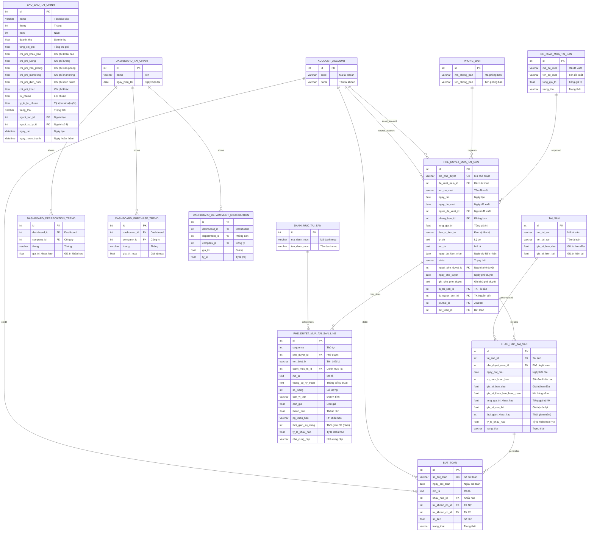

# Sơ đồ ERD Chi tiết - Module Quản lý Tài chính

## 1. Sơ đồ ERD (Mermaid Format)



## 2. Mô hình quan hệ dạng Text

```
                                    ┌─────────────────────┐
                                    │   ACCOUNT_ACCOUNT   │
                                    │   (Tài khoản KT)    │
                                    └──────────┬──────────┘
                                               │
                    ┌──────────────────────────┼──────────────────────────┐
                    │ tai_khoan_no_id          │ tai_khoan_co_id          │
                    │ tk_tai_san_id            │ tk_nguon_von_id          │
                    ▼                          ▼                          │
┌─────────────────────────────┐    ┌─────────────────────────────┐        │
│       BUT_TOAN              │    │   PHE_DUYET_MUA_TAI_SAN     │◄───────┘
│   (Bút toán kế toán)        │    │   (Phê duyệt mua tài sản)   │
├─────────────────────────────┤    ├─────────────────────────────┤
│ • so_but_toan               │    │ • ma_phe_duyet              │
│ • ngay_but_toan             │◄───│ • nguoi_de_xuat_id          │
│ • khau_hao_id (FK)          │    │ • nguoi_phe_duyet_id        │
│ • tai_khoan_no_id (FK)      │    │ • phong_ban_id (FK)         │
│ • tai_khoan_co_id (FK)      │    │ • de_xuat_mua_id (FK)       │
│ • so_tien                   │    │ • state                     │
│ • trang_thai                │    │ • tong_gia_tri              │
└─────────────────────────────┘    └──────────────┬──────────────┘
              ▲                                   │
              │ khau_hao_id                       │ phe_duyet_id
              │                                   ▼
┌─────────────────────────────┐    ┌─────────────────────────────┐
│     KHAU_HAO_TAI_SAN        │    │ PHE_DUYET_MUA_TAI_SAN_LINE  │
│   (Khấu hao tài sản)        │    │ (Chi tiết phê duyệt mua)    │
├─────────────────────────────┤    ├─────────────────────────────┤
│ • tai_san_id (FK)           │    │ • ten_thiet_bi              │
│ • phe_duyet_mua_id (FK)     │    │ • danh_muc_ts_id (FK)       │
│ • ngay_bat_dau              │    │ • so_luong                  │
│ • so_nam_khau_hao           │    │ • don_gia                   │
│ • gia_tri_ban_dau           │    │ • thanh_tien                │
│ • gia_tri_khau_hao_hang_nam │    │ • pp_khau_hao               │
│ • tong_gia_tri_khau_hao     │    │ • thoi_gian_su_dung         │
│ • gia_tri_con_lai           │    └─────────────────────────────┘
│ • trang_thai                │                   ▲
└──────────────┬──────────────┘                   │
               │ tai_san_id                       │ danh_muc_ts_id
               ▼                                  │
┌─────────────────────────────┐    ┌──────────────┴──────────────┐
│         TAI_SAN             │    │     DANH_MUC_TAI_SAN        │
│   (Module Quản lý TS)       │    │   (Module Quản lý TS)       │
└─────────────────────────────┘    └─────────────────────────────┘
```

## 3. Chi tiết các bảng

### 3.1. Khấu hao Tài sản (`khau_hao_tai_san`)
Bảng quản lý việc tính khấu hao cho từng tài sản.

| Field | Type | Mô tả | FK |
|-------|------|-------|-----|
| id | Integer | Khóa chính | - |
| tai_san_id | Integer | Tài sản được khấu hao | → tai_san |
| phe_duyet_mua_id | Integer | Phê duyệt mua liên quan | → phe_duyet_mua_tai_san |
| ngay_bat_dau | Date | Ngày bắt đầu khấu hao | - |
| so_nam_khau_hao | Integer | Số năm khấu hao | - |
| gia_tri_ban_dau | Float | Giá trị ban đầu | - |
| gia_tri_khau_hao_hang_nam | Float | Khấu hao mỗi năm | - |
| tong_gia_tri_khau_hao | Float | Tổng đã khấu hao | - |
| gia_tri_con_lai | Float | Giá trị còn lại | - |
| trang_thai | Selection | nhap/dang_khau_hao/hoan_thanh | - |

### 3.2. Phê duyệt Mua Tài sản (`phe_duyet_mua_tai_san`)
Bảng quản lý quy trình phê duyệt mua sắm tài sản.

| Field | Type | Mô tả | FK |
|-------|------|-------|-----|
| id | Integer | Khóa chính | - |
| ma_phe_duyet | Char | Mã phê duyệt (unique) | - |
| de_xuat_mua_id | Integer | Đề xuất mua liên quan | → de_xuat_mua_tai_san |
| phong_ban_id | Integer | Phòng ban đề xuất | → phong_ban |
| nguoi_de_xuat_id | Integer | Người đề xuất | → res.users |
| nguoi_phe_duyet_id | Integer | Người phê duyệt | → res.users |
| tong_gia_tri | Float | Tổng giá trị | - |
| state | Selection | draft/pending/approved/rejected | - |
| tk_tai_san_id | Integer | Tài khoản tài sản | → account.account |
| tk_nguon_von_id | Integer | Tài khoản nguồn vốn | → account.account |

### 3.3. Chi tiết Phê duyệt (`phe_duyet_mua_tai_san_line`)
Bảng chi tiết các thiết bị trong đơn phê duyệt.

| Field | Type | Mô tả | FK |
|-------|------|-------|-----|
| id | Integer | Khóa chính | - |
| phe_duyet_id | Integer | Phê duyệt cha | → phe_duyet_mua_tai_san |
| ten_thiet_bi | Char | Tên thiết bị | - |
| danh_muc_ts_id | Integer | Danh mục tài sản | → danh_muc_tai_san |
| so_luong | Integer | Số lượng | - |
| don_gia | Float | Đơn giá | - |
| thanh_tien | Float | Thành tiền (computed) | - |
| pp_khau_hao | Selection | Phương pháp khấu hao | - |
| thoi_gian_su_dung | Integer | Thời gian sử dụng (năm) | - |

### 3.4. Bút toán (`but_toan`)
Bảng ghi nhận các bút toán kế toán.

| Field | Type | Mô tả | FK |
|-------|------|-------|-----|
| id | Integer | Khóa chính | - |
| so_but_toan | Char | Số bút toán (unique) | - |
| ngay_but_toan | Date | Ngày bút toán | - |
| khau_hao_id | Integer | Khấu hao liên quan | → khau_hao_tai_san |
| tai_khoan_no_id | Integer | Tài khoản Nợ | → account.account |
| tai_khoan_co_id | Integer | Tài khoản Có | → account.account |
| so_tien | Float | Số tiền | - |
| trang_thai | Selection | nhap/da_ghi_so | - |

### 3.5. Báo cáo Tài chính (`bao_cao_tai_chinh`)
Bảng lưu trữ báo cáo tài chính theo tháng/năm.

| Field | Type | Mô tả | FK |
|-------|------|-------|-----|
| id | Integer | Khóa chính | - |
| name | Char | Tên báo cáo | - |
| thang | Integer | Tháng (1-12) | - |
| nam | Integer | Năm | - |
| doanh_thu | Float | Doanh thu | - |
| tong_chi_phi | Float | Tổng chi phí | - |
| chi_phi_khau_hao | Float | Chi phí khấu hao | - |
| chi_phi_luong | Float | Chi phí lương | - |
| loi_nhuan | Float | Lợi nhuận | - |
| ty_le_loi_nhuan | Float | Tỷ lệ lợi nhuận (%) | - |
| trang_thai | Selection | nhap/da_duyet | - |

## 4. Luồng dữ liệu chính

```
[Đề xuất mua tài sản]
        │
        │ Gửi duyệt
        ▼
┌───────────────────────┐
│ PHE_DUYET_MUA_TAI_SAN │ ◄─── Phòng ban đề xuất
│                       │ ◄─── Người phê duyệt
│   state: pending      │
└───────────┬───────────┘
            │
            │ Phê duyệt
            ▼
┌───────────────────────┐
│ PHE_DUYET_MUA_TAI_SAN │
│   state: approved     │
└───────────┬───────────┘
            │
            │ Tạo tài sản + Tạo khấu hao
            ▼
┌───────────────────────┐      ┌───────────────────────┐
│      TAI_SAN          │─────►│   KHAU_HAO_TAI_SAN    │
│  (Module Tài sản)     │      │ trang_thai: dang_kh   │
└───────────────────────┘      └───────────┬───────────┘
                                           │
                                           │ Hàng tháng/năm
                                           ▼
                               ┌───────────────────────┐
                               │       BUT_TOAN        │
                               │ Nợ: Chi phí khấu hao  │
                               │ Có: Khấu hao lũy kế   │
                               └───────────────────────┘
```

## 5. Thống kê Module Tài chính

| Bảng | Số field | Quan hệ FK | Vai trò |
|------|----------|------------|---------|
| `khau_hao_tai_san` | 17 | 2 | Quản lý khấu hao |
| `phe_duyet_mua_tai_san` | 22 | 6 | Phê duyệt mua sắm |
| `phe_duyet_mua_tai_san_line` | 19 | 2 | Chi tiết phê duyệt |
| `but_toan` | 13 | 3 | Bút toán kế toán |
| `bao_cao_tai_chinh` | 23 | 2 | Báo cáo tài chính |
| `dashboard_tai_chinh` | 7 | 0 | Dashboard |
| `dashboard_depreciation_trend` | - | 2 | Xu hướng khấu hao |
| `dashboard_purchase_trend` | - | 2 | Xu hướng mua sắm |
| `dashboard_department_distribution` | - | 3 | Phân bổ theo phòng ban |
