# Sơ đồ ERD - Module Quản lý Tài sản

## 1. Sơ đồ ERD (Mermaid Format)

```mermaid
erDiagram
    %% ===== BẢNG CHÍNH =====
    
    TAI_SAN {
        int id PK
        varchar ma_tai_san UK "Mã tài sản"
        varchar ten_tai_san "Tên tài sản"
        date ngay_mua_ts "Ngày mua"
        varchar don_vi_tien_te "Đơn vị tiền tệ"
        float gia_tri_ban_dau "Giá trị ban đầu"
        float gia_tri_hien_tai "Giá trị hiện tại"
        int danh_muc_ts_id FK "Danh mục"
        varchar pp_khau_hao "Phương pháp khấu hao"
        int thoi_gian_su_dung "Thời gian sử dụng (năm)"
        float ty_le_khau_hao "Tỷ lệ khấu hao (%)"
        varchar don_vi_tinh "Đơn vị tính"
        varchar trang_thai_thanh_ly "Trạng thái"
        varchar ghi_chu "Ghi chú"
    }

    DANH_MUC_TAI_SAN {
        int id PK
        varchar ma_danh_muc_ts UK "Mã danh mục"
        varchar ten_danh_muc_ts "Tên danh mục"
        varchar mo_ta_danh_muc_ts "Mô tả"
        int so_luong_tong "Số lượng tài sản"
    }

    PHAN_BO_TAI_SAN {
        int id PK
        int tai_san_id FK "Tài sản"
        int phong_ban_id FK "Phòng ban"
        int vi_tri_tai_san_id FK "Vị trí"
        int nhan_vien_su_dung_id FK "Nhân viên sử dụng"
        date ngay_phan_bo "Ngày phân bổ"
        varchar tinh_trang "Tình trạng"
        varchar ghi_chu "Ghi chú"
    }

    %% ===== MƯỢN TRẢ TÀI SẢN =====

    DON_MUON_TAI_SAN {
        int id PK
        varchar ma_don_muon UK "Mã đơn mượn"
        varchar ten_don_muon "Tên đơn mượn"
        int nhan_vien_muon_id FK "Nhân viên mượn"
        int phong_ban_cho_muon_id FK "Phòng ban cho mượn"
        datetime thoi_gian_muon "Thời gian mượn"
        datetime thoi_gian_tra "Thời gian trả dự kiến"
        text ly_do "Lý do mượn"
        varchar trang_thai "Trạng thái"
        int nguoi_duyet_id FK "Người duyệt"
        datetime ngay_duyet "Ngày duyệt"
        datetime ngay_tra_thuc_te "Ngày trả thực tế"
    }

    DON_MUON_TAI_SAN_LINE {
        int id PK
        int don_muon_id FK "Đơn mượn"
        int phan_bo_tai_san_id FK "Phân bổ tài sản"
        int so_luong "Số lượng"
        varchar tinh_trang_truoc "Tình trạng trước"
        varchar tinh_trang_sau "Tình trạng sau"
        int nguoi_giao_id FK "Người giao"
        int nguoi_nhan_tra_id FK "Người nhận trả"
    }

    MUON_TRA_TAI_SAN {
        int id PK
        int ma_don_muon_id FK "Đơn mượn"
        int nhan_vien_muon_id FK "Nhân viên"
        int phong_ban_cho_muon_id FK "Phòng ban"
        datetime thoi_gian_muon "Thời gian mượn"
        datetime thoi_gian_tra_du_kien "Dự kiến trả"
        datetime thoi_gian_tra_thuc_te "Thực tế trả"
        varchar trang_thai "Trạng thái"
        int nguoi_duyet_id FK "Người duyệt"
    }

    %% ===== KIỂM KÊ & LUÂN CHUYỂN =====

    KIEM_KE_TAI_SAN {
        int id PK
        varchar ma_kiem_ke "Mã kiểm kê"
        int phong_ban_id FK "Phòng ban"
        int nhan_vien_kiem_ke_id FK "Nhân viên kiểm kê"
        date ngay_kiem_ke "Ngày kiểm kê"
        varchar trang_thai "Trạng thái"
        text ghi_chu "Ghi chú"
    }

    LUAN_CHUYEN_TAI_SAN {
        int id PK
        varchar ma_luan_chuyen "Mã luân chuyển"
        int bo_phan_nguon FK "Bộ phận nguồn"
        int bo_phan_dich FK "Bộ phận đích"
        date ngay_luan_chuyen "Ngày luân chuyển"
        varchar ly_do "Lý do"
        varchar trang_thai "Trạng thái"
    }

    %% ===== THANH LÝ & BẢO TRÌ =====

    THANH_LY_TAI_SAN {
        int id PK
        int tai_san_id FK "Tài sản"
        int nguoi_thanh_ly_id FK "Người thanh lý"
        date ngay_thanh_ly "Ngày thanh lý"
        float gia_thanh_ly "Giá thanh lý"
        varchar phuong_thuc "Phương thức"
        varchar trang_thai "Trạng thái"
        text ghi_chu "Ghi chú"
    }

    LICH_SU_KY_THUAT {
        int id PK
        int tai_san_id FK "Tài sản"
        varchar loai_su_kien "Loại sự kiện"
        date ngay_thuc_hien "Ngày thực hiện"
        text mo_ta "Mô tả"
        float chi_phi "Chi phí"
        varchar nguoi_thuc_hien "Người thực hiện"
    }

    %% ===== ĐỀ XUẤT MUA =====

    DE_XUAT_MUA_TAI_SAN {
        int id PK
        varchar ma_de_xuat "Mã đề xuất"
        int nguoi_de_xuat_id FK "Người đề xuất"
        int phong_ban_id FK "Phòng ban"
        date ngay_de_xuat "Ngày đề xuất"
        float tong_gia_tri "Tổng giá trị"
        varchar trang_thai "Trạng thái"
        text ly_do "Lý do"
    }

    %% ===== BẢNG LIÊN KẾT =====

    NHAN_VIEN {
        int id PK
        varchar ma_dinh_danh "Mã nhân viên"
        varchar ho_ten "Họ tên"
        varchar email "Email"
    }

    PHONG_BAN {
        int id PK
        varchar ma_phong_ban "Mã phòng ban"
        varchar ten_phong_ban "Tên phòng ban"
    }

    %% ===== QUAN HỆ =====
    
    DANH_MUC_TAI_SAN ||--o{ TAI_SAN : "contains"
    TAI_SAN ||--o{ PHAN_BO_TAI_SAN : "allocated"
    TAI_SAN ||--o{ THANH_LY_TAI_SAN : "disposed"
    TAI_SAN ||--o{ LICH_SU_KY_THUAT : "maintained"
    
    PHONG_BAN ||--o{ PHAN_BO_TAI_SAN : "has"
    PHONG_BAN ||--o{ DON_MUON_TAI_SAN : "lends"
    PHONG_BAN ||--o{ MUON_TRA_TAI_SAN : "manages"
    PHONG_BAN ||--o{ KIEM_KE_TAI_SAN : "audits"
    PHONG_BAN ||--o{ LUAN_CHUYEN_TAI_SAN : "transfers_from"
    PHONG_BAN ||--o{ LUAN_CHUYEN_TAI_SAN : "transfers_to"
    PHONG_BAN ||--o{ DE_XUAT_MUA_TAI_SAN : "requests"
    
    NHAN_VIEN ||--o{ DON_MUON_TAI_SAN : "borrows"
    NHAN_VIEN ||--o{ MUON_TRA_TAI_SAN : "borrows"
    NHAN_VIEN ||--o{ PHAN_BO_TAI_SAN : "uses"
    NHAN_VIEN ||--o{ KIEM_KE_TAI_SAN : "audits"
    NHAN_VIEN ||--o{ THANH_LY_TAI_SAN : "disposes"
    
    DON_MUON_TAI_SAN ||--o{ DON_MUON_TAI_SAN_LINE : "has_lines"
    DON_MUON_TAI_SAN ||--o{ MUON_TRA_TAI_SAN : "tracks"
    PHAN_BO_TAI_SAN ||--o{ DON_MUON_TAI_SAN_LINE : "borrowed"
```



## 2. Mô tả các bảng chính

### 2.1. Tài sản (tai_san)
Bảng trung tâm lưu thông tin chi tiết về từng tài sản.

| Field | Type | Mô tả |
|-------|------|-------|
| id | Integer | Khóa chính |
| ma_tai_san | Varchar | Mã tài sản (unique) |
| ten_tai_san | Varchar | Tên tài sản |
| danh_muc_ts_id | FK → danh_muc_tai_san | Danh mục |
| gia_tri_ban_dau | Float | Giá trị ban đầu |
| gia_tri_hien_tai | Float | Giá trị hiện tại |
| trang_thai_thanh_ly | Selection | dang_su_dung / da_thanh_ly |

### 2.2. Danh mục tài sản (danh_muc_tai_san)
Phân loại tài sản theo nhóm.

| Field | Type | Mô tả |
|-------|------|-------|
| id | Integer | Khóa chính |
| ma_danh_muc_ts | Varchar | Mã danh mục (unique) |
| ten_danh_muc_ts | Varchar | Tên danh mục |
| so_luong_tong | Integer | Tổng số tài sản trong danh mục |

### 2.3. Phân bổ tài sản (phan_bo_tai_san)
Theo dõi tài sản được phân bổ cho phòng ban/nhân viên nào.

| Field | Type | Mô tả |
|-------|------|-------|
| id | Integer | Khóa chính |
| tai_san_id | FK → tai_san | Tài sản |
| phong_ban_id | FK → phong_ban | Phòng ban |
| nhan_vien_su_dung_id | FK → nhan_vien | Nhân viên sử dụng |
| tinh_trang | Selection | binh_thuong / hong / mat |

### 2.4. Đơn mượn tài sản (don_muon_tai_san)
Quản lý đơn mượn tài sản.

| Field | Type | Mô tả |
|-------|------|-------|
| id | Integer | Khóa chính |
| ma_don_muon | Varchar | Mã đơn mượn (unique) |
| nhan_vien_muon_id | FK → nhan_vien | Nhân viên mượn |
| phong_ban_cho_muon_id | FK → phong_ban | Phòng ban cho mượn |
| trang_thai | Selection | nhap / cho_duyet / da_duyet / tu_choi / da_tra |

### 2.5. Chi tiết đơn mượn (don_muon_tai_san_line)
Chi tiết từng tài sản trong đơn mượn.

| Field | Type | Mô tả |
|-------|------|-------|
| id | Integer | Khóa chính |
| don_muon_id | FK → don_muon_tai_san | Đơn mượn |
| phan_bo_tai_san_id | FK → phan_bo_tai_san | Tài sản mượn |
| so_luong | Integer | Số lượng |

## 3. Quan hệ giữa các bảng

```
┌─────────────────────┐
│  DANH_MUC_TAI_SAN   │
│  (Danh mục)         │
└─────────┬───────────┘
          │ 1:N
          ▼
┌─────────────────────┐       ┌─────────────────────┐
│      TAI_SAN        │──────▶│   LICH_SU_KY_THUAT  │
│   (Tài sản)         │ 1:N   │   (Bảo trì/Sửa chữa)│
└─────────┬───────────┘       └─────────────────────┘
          │
          │ 1:N
          ▼
┌─────────────────────┐       ┌─────────────────────┐
│   PHAN_BO_TAI_SAN   │◀─────▶│     PHONG_BAN       │
│   (Phân bổ)         │ N:1   │   (Phòng ban)       │
└─────────┬───────────┘       └─────────┬───────────┘
          │                             │
          │ 1:N                         │ 1:N
          ▼                             ▼
┌─────────────────────┐       ┌─────────────────────┐
│ DON_MUON_TAI_SAN_LINE│      │  DON_MUON_TAI_SAN   │
│ (Chi tiết mượn)     │◀──────│  (Đơn mượn)         │
└─────────────────────┘  N:1  └─────────┬───────────┘
                                        │
                                        │ N:1
                                        ▼
                              ┌─────────────────────┐
                              │     NHAN_VIEN       │
                              │   (Nhân viên)       │
                              └─────────────────────┘
```

## 4. Các bảng phụ trợ

| Bảng | Mô tả | Quan hệ chính |
|------|-------|---------------|
| `kiem_ke_tai_san` | Kiểm kê tài sản định kỳ | phong_ban, nhan_vien |
| `luan_chuyen_tai_san` | Luân chuyển giữa các phòng ban | phong_ban (nguồn, đích) |
| `thanh_ly_tai_san` | Thanh lý tài sản | tai_san, nhan_vien |
| `de_xuat_mua_tai_san` | Đề xuất mua tài sản mới | phong_ban, res_users |

## 5. Thống kê

- **Tổng số bảng**: 11 bảng chính
- **Quan hệ 1:N**: 15 quan hệ
- **Quan hệ N:1**: 8 quan hệ (Foreign Keys)
