# Sơ đồ ERD Tổng quan - Hệ thống Quản lý Tài sản & Tài chính

## 1. Sơ đồ ERD Tổng quan 4 Module (Mermaid)

```mermaid
%%{init: {'theme':'default'}}%%
erDiagram
    %% ========================================
    %% MODULE 1: NHÂN SỰ (nhan_su)
    %% ========================================
    
    NHAN_VIEN {
        int id PK
        varchar ma_dinh_danh UK "Mã định danh"
        varchar ho_ten "Họ tên"
        date ngay_sinh "Ngày sinh"
        varchar email "Email"
        varchar so_dien_thoai "Số điện thoại"
        varchar web_username "Tài khoản web"
        varchar web_password_hash "Mật khẩu (hash)"
        boolean is_web_active "Kích hoạt web"
    }

    PHONG_BAN {
        int id PK
        varchar ma_phong_ban UK "Mã phòng ban"
        varchar ten_phong_ban "Tên phòng ban"
    }

    CHUC_VU {
        int id PK
        varchar ma_chuc_vu UK "Mã chức vụ"
        varchar ten_chuc_vu "Tên chức vụ"
    }

    LICH_SU_CONG_TAC {
        int id PK
        int nhan_vien_id FK
        int phong_ban_id FK
        int chuc_vu_id FK
        date time_start "Ngày bắt đầu"
        date time_end "Ngày kết thúc"
    }

    %% ========================================
    %% MODULE 2: QUẢN LÝ TÀI SẢN (quan_ly_tai_san)
    %% ========================================

    DANH_MUC_TAI_SAN {
        int id PK
        varchar ma_danh_muc_ts UK "Mã danh mục"
        varchar ten_danh_muc_ts "Tên danh mục"
        int so_luong_tong "Số lượng"
    }

    TAI_SAN {
        int id PK
        varchar ma_tai_san UK "Mã tài sản"
        varchar ten_tai_san "Tên tài sản"
        int danh_muc_ts_id FK
        float gia_tri_ban_dau "Giá trị ban đầu"
        float gia_tri_hien_tai "Giá trị hiện tại"
        varchar pp_khau_hao "PP khấu hao"
        int thoi_gian_su_dung "Thời gian SD (năm)"
        varchar trang_thai_thanh_ly "Trạng thái"
    }

    PHAN_BO_TAI_SAN {
        int id PK
        int tai_san_id FK
        int phong_ban_id FK
        int nhan_vien_su_dung_id FK
        date ngay_phan_bo "Ngày phân bổ"
        varchar tinh_trang "Tình trạng"
    }

    DON_MUON_TAI_SAN {
        int id PK
        varchar ma_don_muon UK "Mã đơn mượn"
        int nhan_vien_muon_id FK
        int phong_ban_cho_muon_id FK
        datetime thoi_gian_muon "Thời gian mượn"
        datetime thoi_gian_tra "Thời gian trả"
        varchar trang_thai "Trạng thái"
    }

    DON_MUON_TAI_SAN_LINE {
        int id PK
        int don_muon_id FK
        int phan_bo_tai_san_id FK
        int so_luong "Số lượng"
    }

    THANH_LY_TAI_SAN {
        int id PK
        int tai_san_id FK
        int nguoi_thanh_ly_id FK
        date ngay_thanh_ly "Ngày thanh lý"
        float gia_thanh_ly "Giá thanh lý"
        varchar trang_thai "Trạng thái"
    }

    KIEM_KE_TAI_SAN {
        int id PK
        varchar ma_kiem_ke "Mã kiểm kê"
        int phong_ban_id FK
        int nhan_vien_kiem_ke_id FK
        date ngay_kiem_ke "Ngày kiểm kê"
    }

    DE_XUAT_MUA_TAI_SAN {
        int id PK
        varchar ma_de_xuat UK "Mã đề xuất"
        int nguoi_de_xuat_id FK
        int phong_ban_id FK
        float tong_gia_tri "Tổng giá trị"
        varchar trang_thai "Trạng thái"
    }

    %% ========================================
    %% MODULE 3: QUẢN LÝ TÀI CHÍNH (quan_ly_tai_chinh)
    %% ========================================

    KHAU_HAO_TAI_SAN {
        int id PK
        int tai_san_id FK "Tài sản"
        int phe_duyet_mua_id FK "Phê duyệt mua"
        date ngay_bat_dau "Ngày bắt đầu"
        int so_nam_khau_hao "Số năm khấu hao"
        float gia_tri_ban_dau "Giá trị ban đầu"
        float gia_tri_khau_hao_hang_nam "KH hàng năm"
        float tong_gia_tri_khau_hao "Tổng KH"
        float gia_tri_con_lai "Giá trị còn lại"
        varchar trang_thai "Trạng thái"
    }

    PHE_DUYET_MUA_TAI_SAN {
        int id PK
        varchar ma_phe_duyet UK "Mã phê duyệt"
        int de_xuat_mua_id FK "Đề xuất mua"
        int phong_ban_id FK "Phòng ban"
        int nguoi_de_xuat_id FK "Người đề xuất"
        int nguoi_phe_duyet_id FK "Người phê duyệt"
        float tong_gia_tri "Tổng giá trị"
        varchar state "Trạng thái"
        int but_toan_id FK "Bút toán"
    }

    BUT_TOAN {
        int id PK
        varchar so_but_toan UK "Số bút toán"
        date ngay_but_toan "Ngày bút toán"
        int khau_hao_id FK "Khấu hao"
        int tai_khoan_no_id FK "TK Nợ"
        int tai_khoan_co_id FK "TK Có"
        float so_tien "Số tiền"
        varchar trang_thai "Trạng thái"
        text mo_ta "Mô tả"
    }

    BAO_CAO_TAI_CHINH {
        int id PK
        varchar ma_bao_cao UK "Mã báo cáo"
        varchar ten_bao_cao "Tên báo cáo"
        varchar loai_bao_cao "Loại báo cáo"
        date tu_ngay "Từ ngày"
        date den_ngay "Đến ngày"
        varchar trang_thai "Trạng thái"
    }

    %% ========================================
    %% MODULE 4: TRANG CHỦ (q_trang_chu)
    %% ========================================

    CHATBOT_CONVERSATION {
        int id PK
        int user_id FK "Người dùng"
        varchar title "Tiêu đề"
        boolean is_active "Đang hoạt động"
    }

    CHATBOT_MESSAGE {
        int id PK
        int conversation_id FK "Cuộc hội thoại"
        text content "Nội dung"
        varchar message_type "Loại tin nhắn"
        varchar intent "Intent"
    }

    CHATBOT_ASSISTANT {
        int id PK
        varchar name "Tên"
        text system_prompt "System prompt"
        float temperature "Temperature"
        int max_tokens "Max tokens"
    }

    DASHBOARD_MAIN {
        int id PK
        varchar name "Tên dashboard"
        int total_assets "Tổng tài sản"
        float total_value "Tổng giá trị"
    }

    DASHBOARD_TAI_CHINH {
        int id PK
        varchar name "Tên"
        float tong_gia_tri_tai_san "Tổng GTTS"
        float tong_khau_hao "Tổng khấu hao"
        float gia_tri_con_lai "GT còn lại"
    }

    %% ========================================
    %% QUAN HỆ GIỮA CÁC MODULE
    %% ========================================

    %% Module Nhân sự - Nội bộ
    NHAN_VIEN ||--o{ LICH_SU_CONG_TAC : "has"
    PHONG_BAN ||--o{ LICH_SU_CONG_TAC : "contains"
    CHUC_VU ||--o{ LICH_SU_CONG_TAC : "assigned"

    %% Module Tài sản - Nội bộ
    DANH_MUC_TAI_SAN ||--o{ TAI_SAN : "categorizes"
    TAI_SAN ||--o{ PHAN_BO_TAI_SAN : "allocated"
    TAI_SAN ||--o{ THANH_LY_TAI_SAN : "disposed"
    DON_MUON_TAI_SAN ||--o{ DON_MUON_TAI_SAN_LINE : "has_lines"
    PHAN_BO_TAI_SAN ||--o{ DON_MUON_TAI_SAN_LINE : "borrowed"

    %% Module Tài chính - Nội bộ
    KHAU_HAO_TAI_SAN ||--o{ BUT_TOAN : "generates"
    PHE_DUYET_MUA_TAI_SAN ||--o{ KHAU_HAO_TAI_SAN : "creates"

    %% Module Trang chủ - Nội bộ
    CHATBOT_CONVERSATION ||--o{ CHATBOT_MESSAGE : "contains"

    %% ========================================
    %% LIÊN KẾT GIỮA CÁC MODULE (Cross-module)
    %% ========================================

    %% Nhân sự ↔ Tài sản
    NHAN_VIEN ||--o{ PHAN_BO_TAI_SAN : "uses"
    NHAN_VIEN ||--o{ DON_MUON_TAI_SAN : "borrows"
    NHAN_VIEN ||--o{ KIEM_KE_TAI_SAN : "audits"
    NHAN_VIEN ||--o{ THANH_LY_TAI_SAN : "disposes"
    PHONG_BAN ||--o{ PHAN_BO_TAI_SAN : "manages"
    PHONG_BAN ||--o{ DON_MUON_TAI_SAN : "lends"
    PHONG_BAN ||--o{ KIEM_KE_TAI_SAN : "audits"
    PHONG_BAN ||--o{ DE_XUAT_MUA_TAI_SAN : "requests"

    %% Tài sản ↔ Tài chính
    TAI_SAN ||--o{ KHAU_HAO_TAI_SAN : "depreciated"
    DE_XUAT_MUA_TAI_SAN ||--o{ PHE_DUYET_MUA_TAI_SAN : "approved"
    PHONG_BAN ||--o{ PHE_DUYET_MUA_TAI_SAN : "requests"
```



## 2. Sơ đồ quan hệ giữa 4 Module

```
┌─────────────────────────────────────────────────────────────────────────────┐
│                           HỆ THỐNG QUẢN LÝ TÀI SẢN                          │
└─────────────────────────────────────────────────────────────────────────────┘

    ┌────────────────────┐                    ┌────────────────────┐
    │   MODULE NHÂN SỰ   │◄──────────────────►│  MODULE TRANG CHỦ  │
    │                    │                    │                    │
    │  • nhan_vien       │                    │  • chatbot_*       │
    │  • phong_ban       │                    │  • dashboard_*     │
    │  • chuc_vu         │                    │                    │
    │  • lich_su_cong_tac│                    │  AI Chatbot hỗ trợ │
    └────────┬───────────┘                    └────────────────────┘
             │                                           │
             │ nhan_vien_id                              │ Hiển thị
             │ phong_ban_id                              │ Dashboard
             ▼                                           ▼
    ┌────────────────────┐                    ┌────────────────────┐
    │ MODULE QUẢN LÝ     │──────────────────► │ MODULE QUẢN LÝ     │
    │ TÀI SẢN            │  tai_san_id        │ TÀI CHÍNH          │
    │                    │  de_xuat_mua_id    │                    │
    │  • tai_san         │                    │  • khau_hao_tai_san│
    │  • danh_muc_tai_san│                    │  • phe_duyet_mua   │
    │  • phan_bo_tai_san │                    │  • but_toan        │
    │  • don_muon_tai_san│                    │  • bao_cao_tai_chinh│
    │  • thanh_ly_tai_san│                    │                    │
    │  • kiem_ke_tai_san │                    │                    │
    │  • de_xuat_mua     │                    │                    │
    └────────────────────┘                    └────────────────────┘
```

## 3. Bảng tổng hợp các bảng theo Module

### Module 1: Nhân sự (nhan_su)
| Bảng | Mô tả | Quan hệ |
|------|-------|---------|
| `nhan_vien` | Thông tin nhân viên | → lich_su_cong_tac, phan_bo, don_muon |
| `phong_ban` | Phòng ban | → lich_su_cong_tac, phan_bo, de_xuat |
| `chuc_vu` | Chức vụ | → lich_su_cong_tac |
| `lich_su_cong_tac` | Lịch sử công tác | ← nhan_vien, phong_ban, chuc_vu |

### Module 2: Quản lý Tài sản (quan_ly_tai_san)
| Bảng | Mô tả | Quan hệ |
|------|-------|---------|
| `tai_san` | Tài sản | → phan_bo, thanh_ly, khau_hao |
| `danh_muc_tai_san` | Danh mục phân loại | ← tai_san |
| `phan_bo_tai_san` | Phân bổ tài sản | ← tai_san, phong_ban, nhan_vien |
| `don_muon_tai_san` | Đơn mượn | ← nhan_vien, phong_ban |
| `don_muon_tai_san_line` | Chi tiết đơn mượn | ← don_muon, phan_bo |
| `kiem_ke_tai_san` | Kiểm kê | ← phong_ban, nhan_vien |
| `luan_chuyen_tai_san` | Luân chuyển | ← phong_ban |
| `thanh_ly_tai_san` | Thanh lý | ← tai_san, nhan_vien |
| `de_xuat_mua_tai_san` | Đề xuất mua | ← phong_ban → phe_duyet_mua |

### Module 3: Quản lý Tài chính (quan_ly_tai_chinh)
| Bảng | Mô tả | Quan hệ |
|------|-------|---------|
| `khau_hao_tai_san` | Khấu hao tài sản | ← tai_san, phe_duyet_mua |
| `phe_duyet_mua_tai_san` | Phê duyệt mua | ← de_xuat_mua, phong_ban |
| `phe_duyet_mua_tai_san_line` | Chi tiết phê duyệt | ← phe_duyet_mua |
| `but_toan` | Bút toán kế toán | ← khau_hao |
| `bao_cao_tai_chinh` | Báo cáo tài chính | - |
| `dashboard_tai_chinh` | Dashboard tài chính | - |

### Module 4: Trang chủ (q_trang_chu)
| Bảng | Mô tả | Quan hệ |
|------|-------|---------|
| `chatbot_conversation` | Cuộc hội thoại | ← res_users |
| `chatbot_message` | Tin nhắn | ← chatbot_conversation |
| `chatbot_assistant` | Cấu hình chatbot | - |
| `chatbot_faq` | Câu hỏi thường gặp | - |
| `chatbot_knowledge` | Knowledge base | - |
| `chatbot_policy` | Quy định/Chính sách | - |
| `dashboard_main` | Dashboard chính | - |

## 4. Luồng dữ liệu chính

```
[1] NHÂN SỰ                    [2] QUẢN LÝ TÀI SẢN              [3] QUẢN LÝ TÀI CHÍNH
    
    Nhân viên                      Tài sản                          Khấu hao
       │                              │                                 │
       ├──► Phân bổ ◄────────────────┤                                 │
       │                              │                                 │
       ├──► Đơn mượn ◄───────────────┤                                 │
       │                              │                                 │
       └──► Kiểm kê                   ├──────────────────────────────►──┤
                                      │                                 │
    Phòng ban ──► Đề xuất mua ───────┤                                 │
                        │             │                                 │
                        └─────────────┼──► Phê duyệt mua ──────────────┤
                                      │           │                     │
                                      │           └──► Tạo khấu hao ────┤
                                      │                    │            │
                                      └────────────────────┴──► Bút toán
```

## 5. Thống kê tổng quan

| Module | Số bảng | Bảng chính | Vai trò |
|--------|---------|------------|---------|
| **Nhân sự** | 4 | nhan_vien, phong_ban | Quản lý nhân sự, phòng ban |
| **Quản lý Tài sản** | 11 | tai_san, phan_bo_tai_san | Quản lý vòng đời tài sản |
| **Quản lý Tài chính** | 6 | khau_hao, but_toan | Tài chính, kế toán |
| **Trang chủ** | 8 | chatbot_*, dashboard_* | Giao diện, AI Assistant |
| **Tổng cộng** | **29 bảng** | | |

## 6. Các quan hệ liên module quan trọng

| Từ Module | Đến Module | Quan hệ | Mô tả |
|-----------|------------|---------|-------|
| Nhân sự | Tài sản | `nhan_vien_id` | Nhân viên sử dụng/mượn tài sản |
| Nhân sự | Tài sản | `phong_ban_id` | Phòng ban quản lý tài sản |
| Tài sản | Tài chính | `tai_san_id` | Tài sản được tính khấu hao |
| Tài sản | Tài chính | `de_xuat_mua_id` | Đề xuất → Phê duyệt mua |
| Tài chính | Tài chính | `khau_hao_id` | Khấu hao sinh bút toán |
| Trang chủ | Nhân sự | `user_id` | Chatbot theo user |
