# Sơ đồ ERD Chi tiết - Module Trang chủ (q_trang_chu)

## 1. Sơ đồ ERD (Mermaid Format)

```mermaid
erDiagram
    %% ========================================
    %% PHẦN 1: AI CHATBOT ASSISTANT
    %% ========================================

    CHATBOT_ASSISTANT {
        int id PK
        varchar name "Tên chatbot"
        boolean active "Kích hoạt"
        varchar gemini_api_key "API Key Gemini"
        boolean use_gemini "Sử dụng Gemini"
        float temperature "Temperature (0-1)"
        int max_tokens "Max tokens"
    }

    CHATBOT_CONVERSATION {
        int id PK
        varchar name "Tiêu đề cuộc hội thoại"
        int user_id FK "Người dùng"
        boolean active "Đang hoạt động"
        datetime create_date "Ngày tạo"
    }

    CHATBOT_MESSAGE {
        int id PK
        int conversation_id FK "Cuộc hội thoại"
        text content "Nội dung tin nhắn"
        boolean is_user "Là tin nhắn người dùng"
        datetime timestamp "Thời gian"
        varchar intent "Intent được phát hiện"
        float confidence "Độ tin cậy"
        text sources "Nguồn tham khảo"
    }

    CHATBOT_FAQ {
        int id PK
        varchar question "Câu hỏi"
        text answer "Câu trả lời"
        varchar topic "Chủ đề"
        varchar keywords "Từ khóa"
        int sequence "Thứ tự"
        boolean active "Kích hoạt"
        int ask_count "Số lần hỏi"
    }

    CHATBOT_KNOWLEDGE {
        int id PK
        varchar name "Tên"
        varchar title "Tiêu đề"
        varchar topic "Chủ đề"
        text content "Nội dung (HTML)"
        text content_text "Nội dung (Text)"
        varchar keywords "Từ khóa"
        int sequence "Thứ tự"
        boolean active "Kích hoạt"
        int view_count "Lượt xem"
        int helpful_count "Lượt đánh giá hữu ích"
    }

    CHATBOT_POLICY {
        int id PK
        varchar name "Tên quy định"
        varchar code "Mã quy định"
        text content "Nội dung"
        text summary "Tóm tắt"
        varchar category "Danh mục"
        date effective_date "Ngày hiệu lực"
        date expiry_date "Ngày hết hạn"
        int sequence "Thứ tự"
        boolean active "Kích hoạt"
    }

    CHATBOT_POLICY_ATTACHMENT_REL {
        int chatbot_policy_id FK "Quy định"
        int ir_attachment_id FK "File đính kèm"
    }

    %% ========================================
    %% PHẦN 2: DASHBOARD TỔNG QUAN
    %% ========================================

    DASHBOARD_MAIN {
        int id PK
        varchar name "Tên dashboard"
    }

    DASHBOARD_TAI_CHINH {
        int id PK
        varchar name "Tên"
        date ngay_hien_tai "Ngày hiện tại"
    }

    DASHBOARD_DEPRECIATION_TREND {
        int id PK
        int dashboard_id FK "Dashboard"
        int company_id FK "Công ty"
        varchar thang "Tháng"
        float gia_tri_khau_hao "Giá trị khấu hao"
    }

    DASHBOARD_PURCHASE_TREND {
        int id PK
        int dashboard_id FK "Dashboard"
        int company_id FK "Công ty"
        varchar thang "Tháng"
        float gia_tri_mua "Giá trị mua"
    }

    DASHBOARD_DEPARTMENT_DISTRIBUTION {
        int id PK
        int dashboard_id FK "Dashboard"
        int department_id FK "Phòng ban"
        int company_id FK "Công ty"
        float gia_tri "Giá trị"
        float ty_le "Tỷ lệ phần trăm"
    }

    %% ========================================
    %% BẢNG HỆ THỐNG ODOO
    %% ========================================

    RES_USERS {
        int id PK
        varchar login "Tên đăng nhập"
        varchar name "Tên người dùng"
    }

    IR_ATTACHMENT {
        int id PK
        varchar name "Tên file"
        varchar datas_fname "Tên file gốc"
        binary datas "Nội dung file"
    }

    %% ========================================
    %% QUAN HỆ CHATBOT
    %% ========================================

    RES_USERS ||--o{ CHATBOT_CONVERSATION : "owns"
    CHATBOT_CONVERSATION ||--o{ CHATBOT_MESSAGE : "contains"
    CHATBOT_POLICY ||--o{ CHATBOT_POLICY_ATTACHMENT_REL : "has"
    IR_ATTACHMENT ||--o{ CHATBOT_POLICY_ATTACHMENT_REL : "attached_to"

    %% ========================================
    %% QUAN HỆ DASHBOARD
    %% ========================================

    DASHBOARD_TAI_CHINH ||--o{ DASHBOARD_DEPRECIATION_TREND : "shows"
    DASHBOARD_TAI_CHINH ||--o{ DASHBOARD_PURCHASE_TREND : "shows"
    DASHBOARD_TAI_CHINH ||--o{ DASHBOARD_DEPARTMENT_DISTRIBUTION : "shows"
```



## 2. Kiến trúc Module Trang chủ

```
┌─────────────────────────────────────────────────────────────────────────────┐
│                        MODULE TRANG CHỦ (q_trang_chu)                        │
│                                                                             │
│  ┌─────────────────────────────────────────────────────────────────────┐   │
│  │                     AI CHATBOT ASSISTANT                             │   │
│  │                                                                      │   │
│  │  ┌─────────────────┐     ┌─────────────────┐     ┌───────────────┐  │   │
│  │  │ chatbot_assistant│     │chatbot_conversation│    │chatbot_message│  │   │
│  │  │ (Cấu hình AI)   │     │ (Cuộc hội thoại)│────▶│ (Tin nhắn)    │  │   │
│  │  └─────────────────┘     └────────┬────────┘     └───────────────┘  │   │
│  │                                   │                                  │   │
│  │                                   │ user_id                          │   │
│  │                                   ▼                                  │   │
│  │                          ┌───────────────┐                           │   │
│  │                          │   res_users   │                           │   │
│  │                          │  (Người dùng) │                           │   │
│  │                          └───────────────┘                           │   │
│  │                                                                      │   │
│  │  ┌─────────────────────────────────────────────────────────────┐    │   │
│  │  │              KNOWLEDGE BASE (Cơ sở tri thức)                │    │   │
│  │  │                                                              │    │   │
│  │  │  ┌─────────────┐  ┌─────────────┐  ┌─────────────┐          │    │   │
│  │  │  │ chatbot_faq │  │chatbot_know │  │chatbot_policy│          │    │   │
│  │  │  │ (FAQ)       │  │  (Kiến thức)│  │ (Quy định)  │          │    │   │
│  │  │  └─────────────┘  └─────────────┘  └──────┬──────┘          │    │   │
│  │  │                                           │                  │    │   │
│  │  │                                           │ attachment_ids   │    │   │
│  │  │                                           ▼                  │    │   │
│  │  │                                   ┌─────────────┐            │    │   │
│  │  │                                   │ir_attachment│            │    │   │
│  │  │                                   │(File đính kèm)           │    │   │
│  │  │                                   └─────────────┘            │    │   │
│  │  └─────────────────────────────────────────────────────────────┘    │   │
│  └──────────────────────────────────────────────────────────────────────┘   │
│                                                                             │
│  ┌─────────────────────────────────────────────────────────────────────┐   │
│  │                        DASHBOARD TỔNG QUAN                           │   │
│  │                                                                      │   │
│  │  ┌─────────────────┐                                                 │   │
│  │  │  dashboard_main │ ◄──── Dashboard chính (Trang chủ)               │   │
│  │  └─────────────────┘                                                 │   │
│  │                                                                      │   │
│  │  ┌─────────────────────────────────────────────────────────────┐    │   │
│  │  │           DASHBOARD TÀI CHÍNH (dashboard_tai_chinh)          │    │   │
│  │  │                                                              │    │   │
│  │  │  ┌───────────────────┐  ┌───────────────────┐               │    │   │
│  │  │  │ depreciation_trend│  │  purchase_trend   │               │    │   │
│  │  │  │ (Xu hướng KH)     │  │ (Xu hướng mua)    │               │    │   │
│  │  │  └───────────────────┘  └───────────────────┘               │    │   │
│  │  │                                                              │    │   │
│  │  │  ┌─────────────────────────────────────────┐                │    │   │
│  │  │  │      department_distribution            │                │    │   │
│  │  │  │     (Phân bổ theo phòng ban)            │                │    │   │
│  │  │  └─────────────────────────────────────────┘                │    │   │
│  │  └─────────────────────────────────────────────────────────────┘    │   │
│  └──────────────────────────────────────────────────────────────────────┘   │
└─────────────────────────────────────────────────────────────────────────────┘
```

## 3. Chi tiết các bảng

### 3.1. AI Chatbot

#### `chatbot_assistant` - Cấu hình Chatbot
Bảng lưu cấu hình cho AI Chatbot.

| Field | Type | Mô tả |
|-------|------|-------|
| id | Integer | Khóa chính |
| name | Char | Tên chatbot |
| active | Boolean | Kích hoạt |
| gemini_api_key | Char | API Key Google Gemini |
| use_gemini | Boolean | Sử dụng Gemini AI |
| temperature | Float | Temperature (0-1) - độ sáng tạo |
| max_tokens | Integer | Số token tối đa trong phản hồi |

#### `chatbot_conversation` - Cuộc hội thoại
Bảng lưu các cuộc hội thoại của người dùng.

| Field | Type | Mô tả | FK |
|-------|------|-------|-----|
| id | Integer | Khóa chính | - |
| name | Char | Tiêu đề cuộc hội thoại | - |
| user_id | Integer | Người dùng | → res.users |
| active | Boolean | Đang hoạt động | - |

#### `chatbot_message` - Tin nhắn
Bảng lưu từng tin nhắn trong cuộc hội thoại.

| Field | Type | Mô tả | FK |
|-------|------|-------|-----|
| id | Integer | Khóa chính | - |
| conversation_id | Integer | Cuộc hội thoại | → chatbot_conversation |
| content | Text | Nội dung tin nhắn | - |
| is_user | Boolean | True = người dùng, False = bot | - |
| timestamp | Datetime | Thời gian gửi | - |
| intent | Char | Intent được phát hiện | - |
| confidence | Float | Độ tin cậy (0-1) | - |
| sources | Text | Nguồn tham khảo | - |

### 3.2. Knowledge Base (Cơ sở tri thức)

#### `chatbot_faq` - Câu hỏi thường gặp
Bảng lưu các cặp câu hỏi - trả lời.

| Field | Type | Mô tả |
|-------|------|-------|
| id | Integer | Khóa chính |
| question | Char | Câu hỏi |
| answer | Text | Câu trả lời |
| topic | Char | Chủ đề (tai_san, muon_tra, bao_hanh, ...) |
| keywords | Char | Từ khóa để tìm kiếm |
| sequence | Integer | Thứ tự hiển thị |
| active | Boolean | Kích hoạt |
| ask_count | Integer | Số lần được hỏi |

#### `chatbot_knowledge` - Kiến thức
Bảng lưu các bài viết kiến thức chi tiết.

| Field | Type | Mô tả |
|-------|------|-------|
| id | Integer | Khóa chính |
| name | Char | Tên bài viết |
| title | Char | Tiêu đề |
| topic | Char | Chủ đề |
| content | Text | Nội dung (HTML) |
| content_text | Text | Nội dung (Plain text) |
| keywords | Char | Từ khóa |
| sequence | Integer | Thứ tự |
| active | Boolean | Kích hoạt |
| view_count | Integer | Lượt xem |
| helpful_count | Integer | Lượt đánh giá hữu ích |

#### `chatbot_policy` - Quy định/Chính sách
Bảng lưu các quy định, chính sách của công ty.

| Field | Type | Mô tả |
|-------|------|-------|
| id | Integer | Khóa chính |
| name | Char | Tên quy định |
| code | Char | Mã quy định |
| content | Text | Nội dung chi tiết |
| summary | Text | Tóm tắt |
| category | Selection | tai_san / tai_chinh / nhan_su / chung |
| effective_date | Date | Ngày có hiệu lực |
| expiry_date | Date | Ngày hết hạn |
| sequence | Integer | Thứ tự |
| active | Boolean | Kích hoạt |

### 3.3. Dashboard

#### `dashboard_main` - Dashboard chính
Bảng TransientModel cho dashboard trang chủ.

| Field | Type | Mô tả | Computed |
|-------|------|-------|----------|
| id | Integer | Khóa chính | - |
| name | Char | Tên dashboard | - |
| total_assets | Integer | Tổng số tài sản | ✓ |
| active_assets | Integer | Tài sản đang sử dụng | ✓ |
| total_value | Float | Tổng giá trị | ✓ |
| pending_loans | Integer | Đơn mượn chờ duyệt | ✓ |

#### `dashboard_tai_chinh` - Dashboard tài chính
Bảng TransientModel cho dashboard tài chính.

| Field | Type | Mô tả |
|-------|------|-------|
| id | Integer | Khóa chính |
| name | Char | Tên |
| ngay_hien_tai | Date | Ngày hiện tại |

## 4. Luồng hoạt động Chatbot

```
[Người dùng]
     │
     │ Gửi tin nhắn
     ▼
┌─────────────────────────────────────────────────────────────────┐
│                    CHATBOT ASSISTANT                             │
│                                                                  │
│  1. Tạo/lấy conversation (chatbot_conversation)                  │
│                          │                                       │
│  2. Lưu tin nhắn người dùng (chatbot_message)                    │
│                          │                                       │
│  3. Detect Intent        │                                       │
│     ├─► muon_tai_san     │                                       │
│     ├─► bao_hanh         │                                       │
│     ├─► thanh_ly         │                                       │
│     ├─► thong_ke         │                                       │
│     └─► general          │                                       │
│                          │                                       │
│  4. Tìm kiếm Knowledge Base                                      │
│     ├─► chatbot_faq (FAQ)                                        │
│     ├─► chatbot_knowledge (Kiến thức)                            │
│     └─► chatbot_policy (Quy định)                                │
│                          │                                       │
│  5. Gọi Gemini AI với context                                    │
│     ├─► User message                                             │
│     ├─► Intent                                                   │
│     ├─► Knowledge base context                                   │
│     └─► System prompt                                            │
│                          │                                       │
│  6. Lưu phản hồi bot (chatbot_message)                           │
│                          │                                       │
│  7. Trả về cho người dùng                                        │
└─────────────────────────────────────────────────────────────────┘
     │
     ▼
[Hiển thị phản hồi + Suggestions]
```

## 5. Thống kê Module Trang chủ

### Phân loại bảng

| Nhóm | Số bảng | Danh sách |
|------|---------|-----------|
| **Chatbot Core** | 3 | assistant, conversation, message |
| **Knowledge Base** | 4 | faq, knowledge, policy, policy_attachment_rel |
| **Dashboard** | 5 | main, tai_chinh, depreciation_trend, purchase_trend, department_distribution |
| **Tổng** | **12 bảng** | |

### Quan hệ chính

| Từ | Đến | Quan hệ | Mô tả |
|---|---|---|---|
| res_users | chatbot_conversation | 1:N | User có nhiều cuộc hội thoại |
| chatbot_conversation | chatbot_message | 1:N | Conversation có nhiều tin nhắn |
| chatbot_policy | ir_attachment | N:M | Policy có nhiều file đính kèm |
| dashboard_tai_chinh | dashboard_*_trend | 1:N | Dashboard có nhiều trend data |

## 6. Tích hợp với các Module khác

```
┌─────────────────────────────────────────────────────────────────┐
│                     MODULE TRANG CHỦ                             │
│                                                                  │
│  ┌─────────────────┐                                             │
│  │ AI CHATBOT      │                                             │
│  └────────┬────────┘                                             │
│           │ Truy vấn dữ liệu từ các module                       │
│           ▼                                                      │
│  ┌─────────────────────────────────────────────────────────┐    │
│  │                    ORM QUERIES                           │    │
│  │                                                          │    │
│  │  • env['tai_san'].search_count([])                       │    │
│  │  • env['phan_bo_tai_san'].search([...])                  │    │
│  │  • env['don_muon_tai_san'].search([...])                 │    │
│  │  • env['khau_hao_tai_san'].search_read([...])            │    │
│  │  • env['nhan_vien'].search([...])                        │    │
│  └─────────────────────────────────────────────────────────┘    │
│           │                                                      │
│           ▼                                                      │
└───────────┼─────┬────────┬────────┬──────────────────────────────┘
            │     │        │        │
            ▼     ▼        ▼        ▼
┌───────────┐ ┌────────┐ ┌────────┐ ┌──────────┐
│ NHÂN SỰ   │ │TÀI SẢN │ │TÀI CHÍNH│ │ ODOO BASE│
│           │ │        │ │        │ │(res.users)│
└───────────┘ └────────┘ └────────┘ └──────────┘
```
