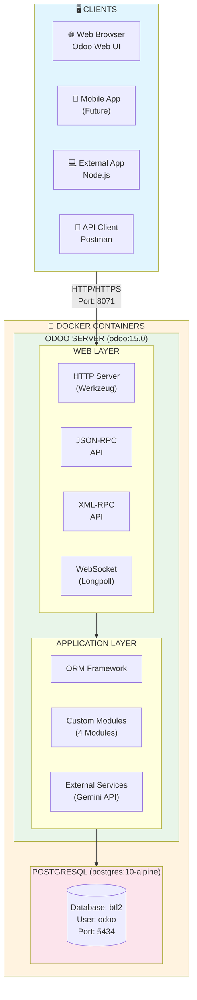
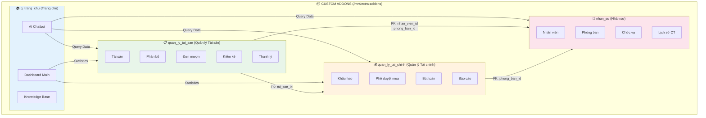
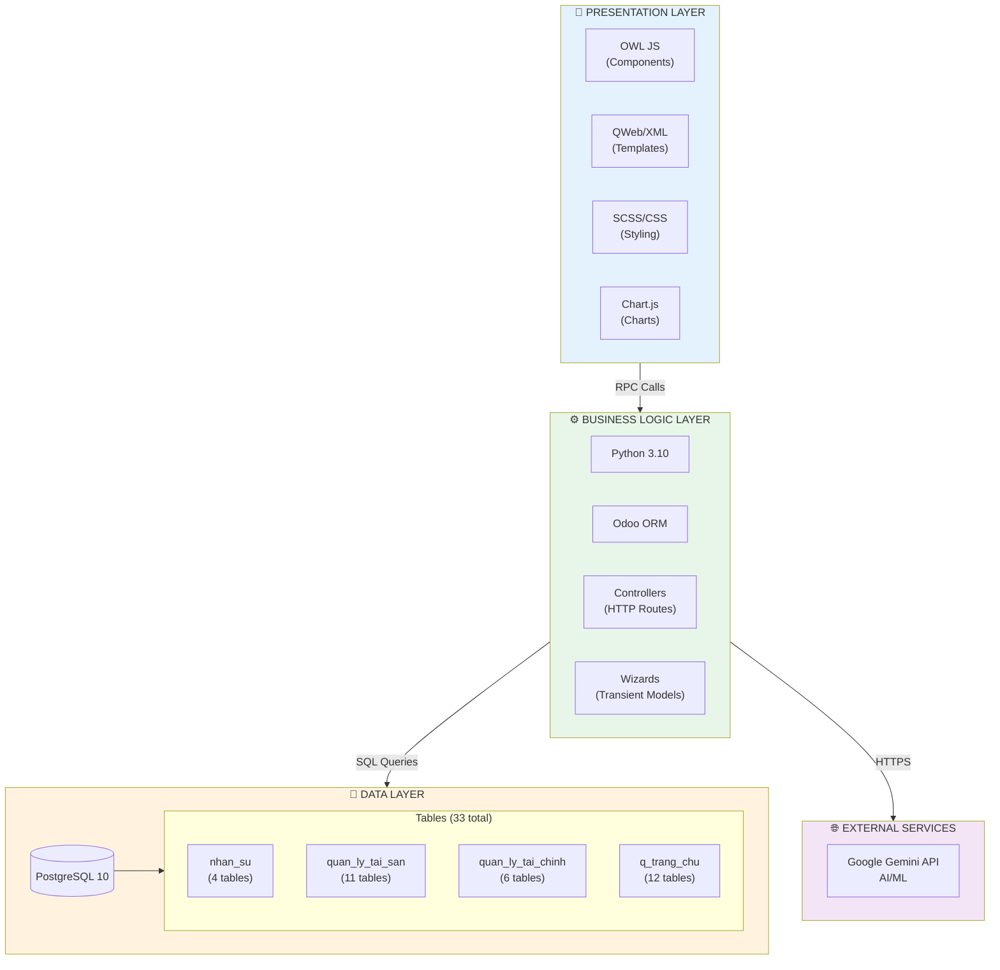
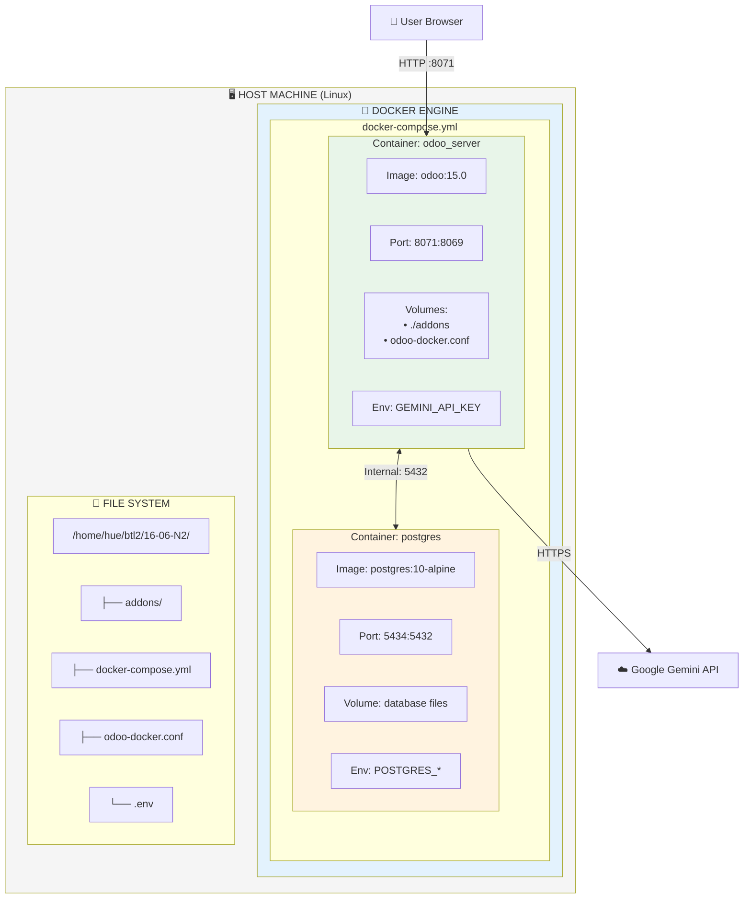
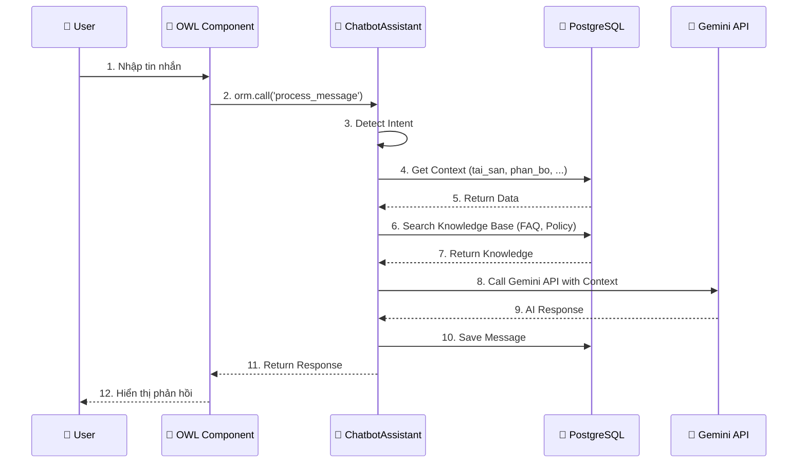
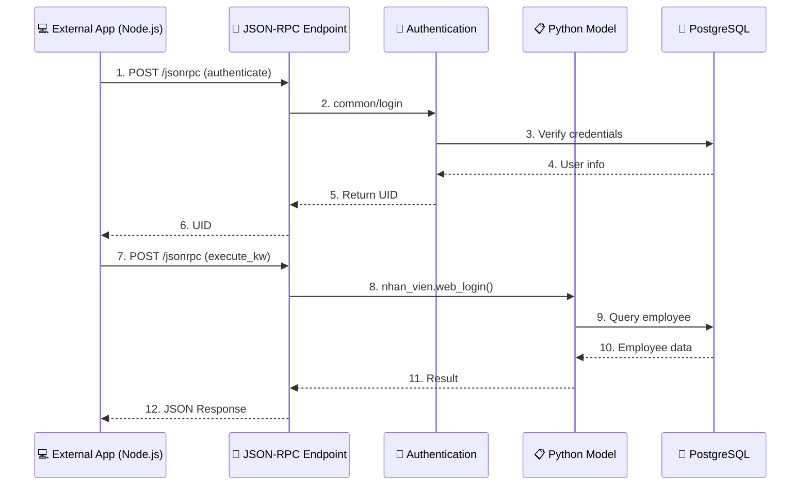
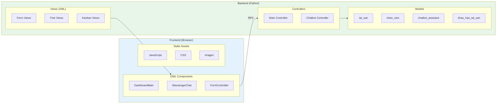
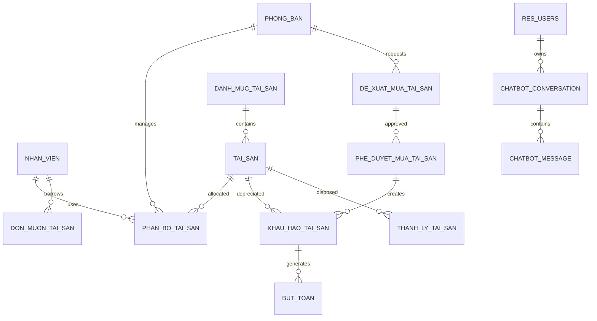
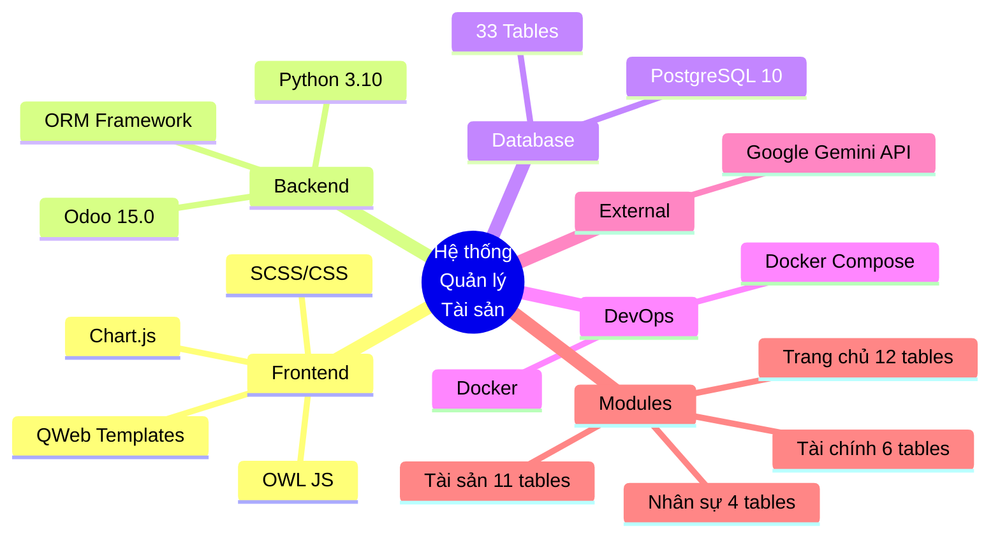

# Sơ đồ Kiến trúc Tổng thể Hệ thống (Mermaid Format)

## 1. Kiến trúc Tổng quan (High-Level Architecture)

## 2. Kiến trúc 4 Module

## 3. Kiến trúc Kỹ thuật (3-Layer Architecture)

## 4. Kiến trúc Triển khai (Deployment)

## 5. Luồng xử lý Chatbot (Sequence Diagram)

## 6. Luồng xử lý External API (Sequence Diagram)

## 7. Sơ đồ Component

## 8. Sơ đồ Database (ER Overview)

## 9. Tóm tắt Công nghệ

## 10. Thông tin Triển khai

| Component | Technology | Version | Port |
|-----------|------------|---------|------|
| Web Server | Odoo | 15.0 | 8071 |
| Database | PostgreSQL | 10-alpine | 5434 |
| Container | Docker | Latest | - |
| AI Service | Google Gemini | 1.5-flash | - |

| Module | Tables | Description |
|--------|--------|-------------|
| `nhan_su` | 4 | Quản lý nhân viên, phòng ban, chức vụ |
| `quan_ly_tai_san` | 11 | Quản lý tài sản, phân bổ, mượn trả |
| `quan_ly_tai_chinh` | 6 | Khấu hao, phê duyệt, bút toán |
| `q_trang_chu` | 12 | Dashboard, AI Chatbot |
| **Total** | **33** | |
